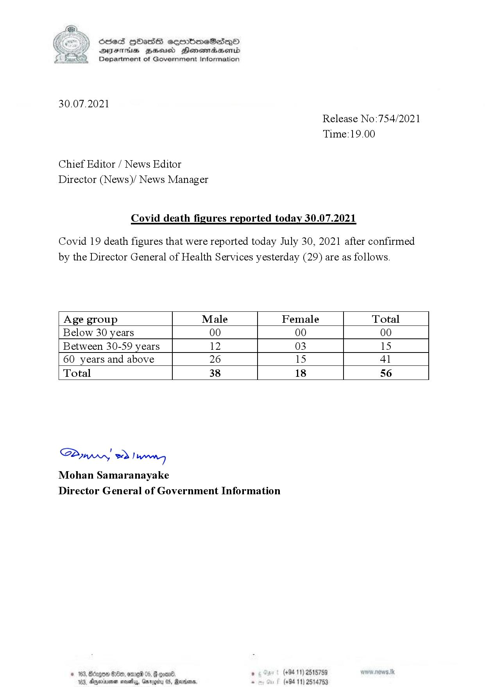

# Press Release - 2021.07.30 - Covid 19 Infection Deaths 
Key: 5dd6fef6195638c77bea5ede18510e82 

---
```
(6 S) ScseS HOasdS cerrbmeSdQo
DFTs BHEosd Henewtaeasernid
Department of Government Information

 

30.07.2021
Release No:754/2021
Time:19.00

Chief Editor / News Editor
Director (News)/ News Manager

Covid death figures reported today 30.07.2021

Covid 19 death figures that were reported today July 30, 2021 after confirmed
by the Director General of Health Services yesterday (29) are as follows.

 

 

 

 

 

Age group Male Female Total
Below 30 years 00 00 00
Between 30-59 years 12 03 15
60 years and above 26 15 41
Total 38 18 56

 

 

 

 

 

 

SAmwwy 2) wong
Mohan Samaranayake
Director General of Government Information

 

© 163 B8dd, OEP 05, G gone. , (+94 11) 2515759
123, Ageia nasty, Garrgidy 05, Rano, . (+94 11) 2514753

```
