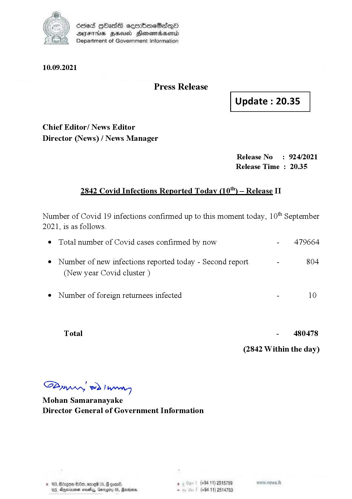

# Press Release - 2021.09.10  - Covid 19 Infection Report 
Key: 5ddc36106d1610aa4325c7df72c46012 

---
```
dosed GOass eemmbmeSadepO
DFS BHU Honswnradasentd
Department of Government Information

 

 

10.09.2021

Press Release

Chief Editor/ News Editor
Director (News) / News Manager

 

 

Update : 20.35

 

 

Release No: 924/2021
Release Time : 20.35

2842 Covid Infections Reported Today (10) — Release II

Number of Covid 19 infections confirmed up to this moment today, 10" September

2021, is as follows.

¢ Total number of Covid cases confirmed by now

¢ Number of new infections reported today - Second report

(New year Covid cluster )

¢ Number of foreign returnees infected

Total

SPynprn wd Inn
Mohan Samaranayake
Director General of Government Information

  

© 163, Bdogon Om, ome®

6. . (+94 11) 2515759
163, Dyeinionen sevethys, Gar S, Revco, . (+94 11) 2514753

- 479664

804

- 480478
(2842 Within the day)

```
