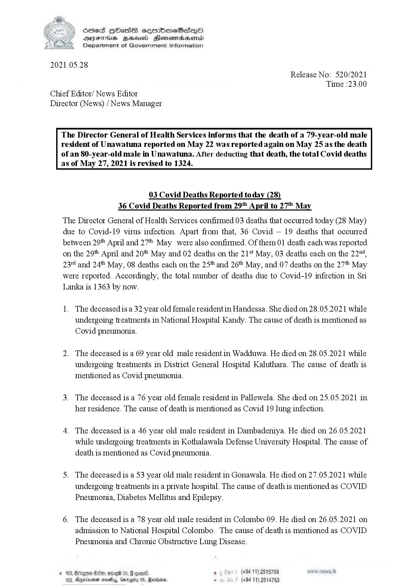

# Press Release - 2021.05.28 - Covid 19 Infection deaths 
Key: 5e03a7f77f0eb32a93e9cbec297479e3 

---
```
SeS HOHasS sermimeSes—poO
SYEThis ZHsusd Henomadsemd
Department of Government Information

 

2021.05.28
Release No: 520/2021
Time :23.00
Chief Editor/ News Editor
Director (News) / News Manager

 

The Director General of Health Services informs that the death of a 79-year-old male
resident of Unawatuna reported on May 22 was reported again on May 25 as the death
of an 80-year-old male in Unawatuna. After deducting that death, the total Covid deaths
as of May 27, 2021 is revised to 1324.

 

 

 

03 Covid Deaths Reported today (28)
36 Covid Deaths Reported from 29" April to 27" May

The Director General of Health Services confirmed 03 deaths that occurred today (28 May)
due to Covid-19 virus infection. Apart from that, 36 Covid — 19 deaths that occurred
between 29" April and 27 May were also confirmed. Of them 01 death each was reported
on the 29t April and 20" May and 02 deaths on the 21** May, 03 deaths each on the 22"4,
23" and 24 May, 08 deaths each on the 25 and 26t* May, and 07 deaths on the 27" May
were reported. Accordingly, the total number of deaths due to Covid-19 infection in Sri
Lanka is 1363 by now.

1. The deceasedis a 32 year old female resident in Handessa. She died on 28.05.2021 while
undergoing treatments in National Hospital Kandy. The cause of death is mentioned as
Covid pneumonia.

2. The deceased is a 69 year old male resident in Wadduwa. He died on 28.05.2021 while
undergoing treatments in District General Hospital Kaluthara. The cause of death is
mentioned as Covid pneumonia.

3. The deceased is a 76 year old female resident in Pallewela. She died on 25.05.2021 in
her residence. The cause of death is mentioned as Covid 19 lung infection.

4. The deceased is a 46 year old male resident in Dambadeniya. He died on 26.05.2021
while undergoing treatments in Kothalawala Defense University Hospital. The cause of
death is mentioned as Covid pneumonia.

5. The deceased is a 53 year old male resident in Gonawala. He died on 27.05.2021 while
undergoing treatments in a private hospital. The cause of death is mentioned as COVID
Pneumonia, Diabetes Mellitus and Epilepsy.

6. The deceased is a 78 year old male resident in Colombo 09. He died on 26.05.2021 on
admission to National Hospital Colombo. The cause of death is mentioned as COVID
Pneumonia and Chronic Obstructive Lung Disease.

, +94 11) 2515759
Baxins . (+84 11) 2514753

 

```
