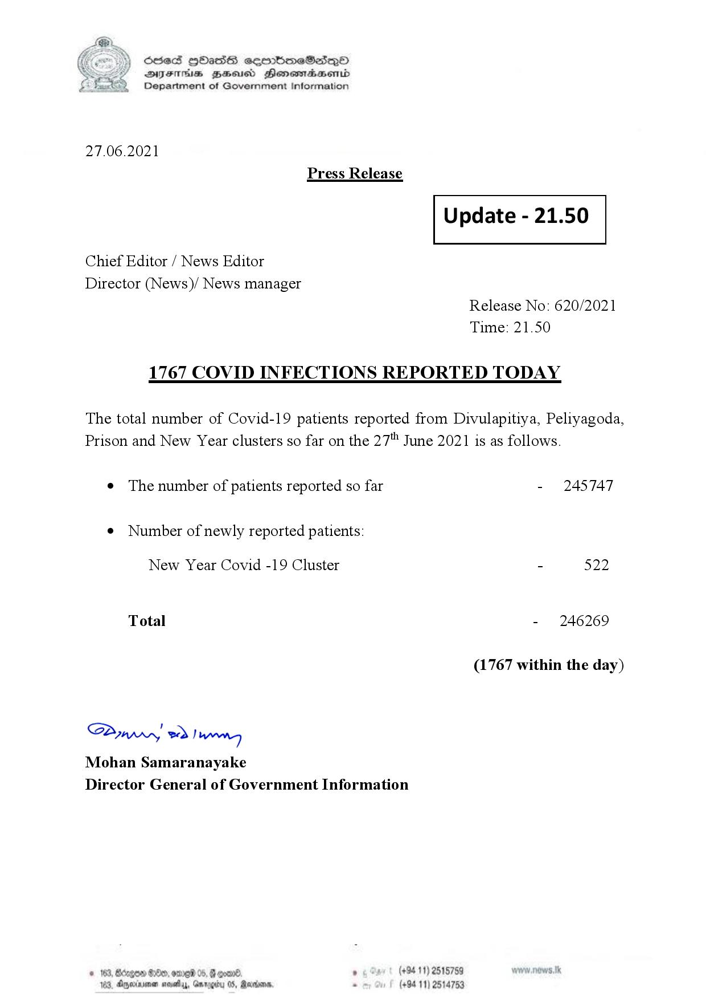

# Press Release - 2021.06.27 - Covid 19 infection report 
Key: 5f1b662cb5f215dfc9b23df8ed9390ba 

---
```
(6 S) ScseS HOasdS cerrbmeSdQo
DFTs BHEosd Henewtaeasernid
Department of Government Information

 

27.06.2021
Press Release

Chief Editor / News Editor
Director (News)/ News manager

 

 

Update - 21.50

 

 

Release No: 620/2021
Time: 21.50

1767 COVID INFECTIONS REPORTED TODAY

The total number of Covid-19 patients reported from Divulapitiya, Peliyagoda,
Prison and New Year clusters so far on the 27" June 2021 is as follows.

e The number of patients reported so far
¢ Number of newly reported patients:

New Year Covid -19 Cluster

Total

Saw 2) won,
Mohan Samaranayake
Director General of Government Information

 

- 245747

- 522

- 246269

(1767 within the day)

. (+94 11) 2518759
(+94 11) 2514753

```
