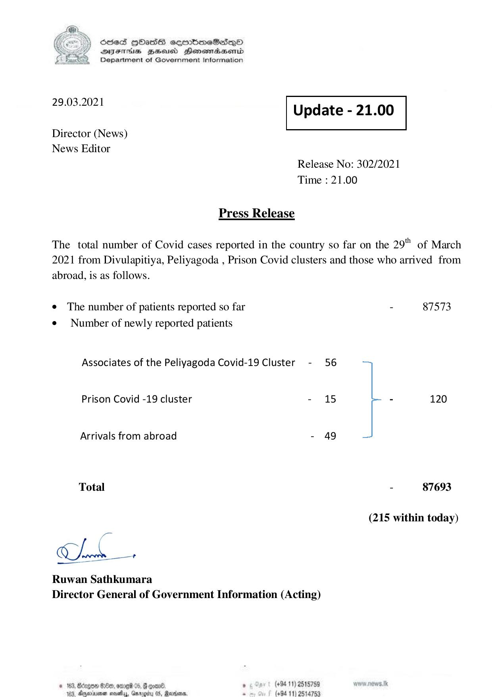

# Press Release - 2021.03.29 
Key: 5f539dbce1d7349308224ff89f75cfef 

---
```
) ScdeS HOadS cermbmeSsdQo
DVEFIHS HHosd Honomabsenid
Department of Government Information

 

 

29.03.2021 Update - 21.00

 

 

 

Director (News)
News Editor

Release No: 302/2021
Time : 21.00

Press Release

The total number of Covid cases reported in the country so far on the 29" of March
2021 from Divulapitiya, Peliyagoda , Prison Covid clusters and those who arrived from
abroad, is as follows.

e The number of patients reported so far - 87573
¢ Number of newly reported patients

Associates of the Peliyagoda Covid-19 Cluster - 56
Prison Covid -19 cluster - 15 - 120
Arrivals from abroad - 49
Total - 87693

(215 within today)

=

ao

Ruwan Sathkumara
Director General of Government Information (Acting)

5, F goed, . (+94 11) 2515759
Qargity 05, Rada. e (+94 11) 2514753

 

```
