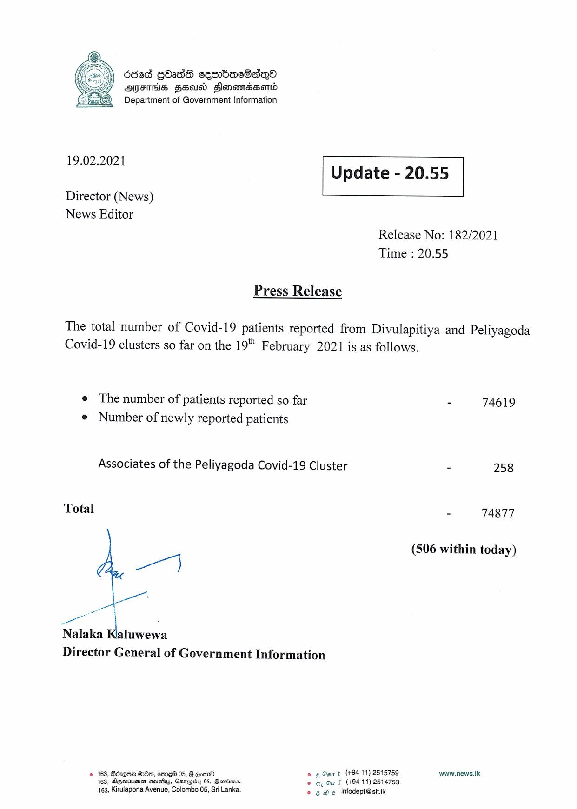

# Press Release - 2021.02.19 
Key: 5f91c1aebe3aa85fe68883c1771c26c4 

---
```
   

6868 GOadS cembac8sqQeo
yy OFTHS FSD Fonendssord
Department of Government Information

 

19.02.2021

 

Update - 20.55

 

 

Director (News)
News Editor

Release No: 182/2021
Time : 20.55

Press Release

The total number of Covid-19 patients reported from Divulapitiya and Peliyagoda
Covid-19 clusters so far on the 19" F ebruary 2021 is as follows.

e The number of patients reported so far
e Number of newly reported patients

Associates of the Peliyagoda Covid-19 Cluster

Total

|

rl

a
Nalaka Kialuwewa
Director General of Government Information

© 163, Bdz@oe On, eme® 05, G @omd. © ¢Gsrt (+94 11) 2515759
168, Aqeciuman seuiy, Osnapiby 05, Beveisns. © my Gu f (+94 11) 2514753

163, Kirulapona Avenue, Colombo 05, Sri Lanka. © 6 We infodept@sttik

- 74619

= 258

- 74877

(506 within today)

www.news.Ik

```
