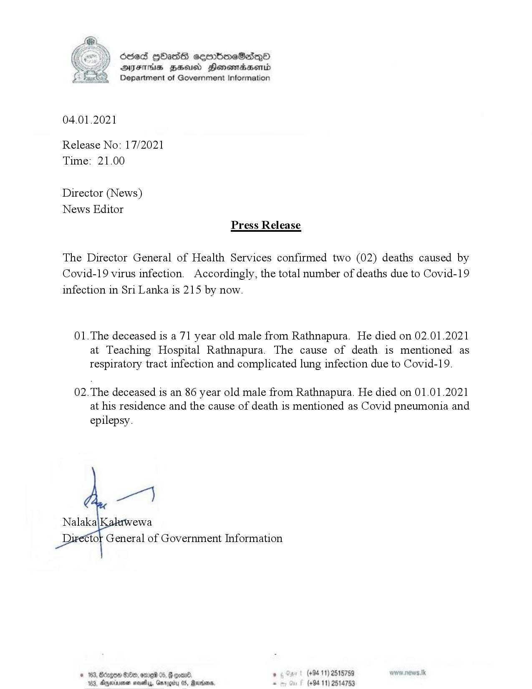

# Press Release - 2021.01.04 - 2 covid 19 deaths have been reported 
Key: 6001f31a95bf6e5f71bad781fa7c2e22 

---
```
 

osed HOHass serrbmeSadq®
DAIFIHS HH Honewiaaentd
fat) Department of Government Information

  

04.01.2021

Release No: 17/2021
Time: 21.00

Director (News)
News Editor
Press Release

The Director General of Health Services confirmed two (02) deaths caused by
Covid-19 virus infection. Accordingly, the total number of deaths due to Covid-19
infection in Sri Lanka is 215 by now.

01.The deceased is a 71 year old male from Rathnapura. He died on 02.01.2021
at Teaching Hospital Rathnapura. The cause of death is mentioned as
respiratory tract infection and complicated lung infection due to Covid-19.

02.The deceased is an 86 year old male from Rathnapura. He died on 01.01.2021
at his residence and the cause of death is mentioned as Covid pneumonia and

epilepsy.

   

€tor General of Government Information

(+94 11) 2515759
4753

© 163, Bcogon Oe, ome 05, G goad .
103, Dexia nowy, Garooity 05, arias, . (+9411)

 

```
