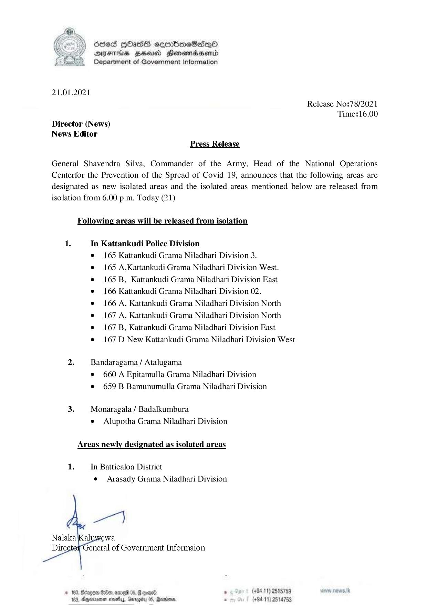

# Press Release - 2021.01.21 -Isolation lifting 
Key: 6009d8a736dcac4b5085578e6d9a41cc 

---
```
  
 

D) Scse3 GOATS ceorbmeSedQo
DsFHAs BEd Honsmdbsentd
Department of Government Information

21.01.2021

Release No:78/2021
Time:16.00
Director (News)
News Editor
Press Release

General Shavendra Silva, Commander of the Army, Head of the National Operations
Centerfor the Prevention of the Spread of Covid 19, announces that the following areas are
designated as new isolated areas and the isolated areas mentioned below are released from
isolation from 6.00 p.m. Today (21)

Following areas will be released from isolation

1. In Kattankudi Police Division
e 165 Kattankudi Grama Niladhari Division 3.
e 165 A,Kattankudi Grama Niladhari Division West.
e 165 B, Kattankudi Grama Niladhari Division East
¢ 166 Kattankudi Grama Niladhari Division 02.
e 166A, Kattankudi Grama Niladhari Division North
e 167A, Kattankudi Grama Niladhari Division North
e 167 B, Kattankudi Grama Niladhari Division East
¢ 167 D New Kattankudi Grama Niladhari Division West

  

  

2. Bandaragama / Atalugama
¢ 660 A Epitamulla Grama Niladhari Division
e 659 B Bamunumulla Grama Niladhari Division

3. Monaragala / Badalkumbura
e Alupotha Grama Niladhari Division

Areas newly designated as isolated areas

 

1. In Batticaloa District
e Arasady Grama Niladhari Division

 

# 183, Bergen Se, ore 04, Gcoan® , (+94.11) 2515759 new. nows.tk
Wed, Ageissner aoe, Gmrogiby 05, Rasa. . (+9411) 2514753

```
