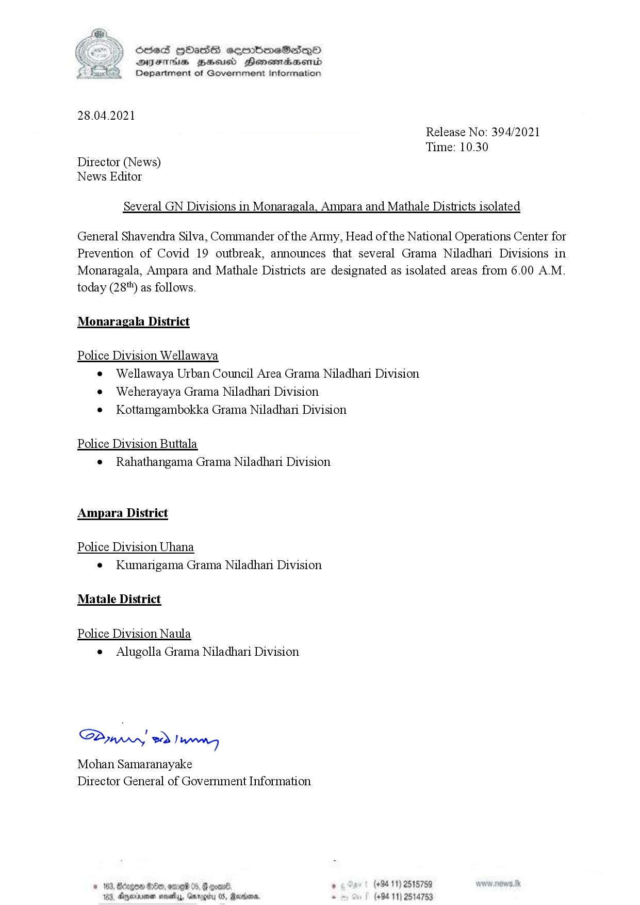

# Press Release - 2021.04.28 - Sevaral GN Divisions in Monaragala,Ampara and Mathale Districts isolated 
Key: 6244cbfec9e3e03ff42a8c45f831ccde 

---
```
SseS HbHasS seormimeSesepO
SYsThiE gBesucd Henemaaemd
Department of Government Information

 

28.04.2021

Director (News)
News Editor

Release No: 394/2021
Time: 10.30

Several GN Divisions in Monaragala, Ampara and Mathale Districts isolated

General Shavendra Silva, Commander of the Army, Head of the National Operations Center for

Prevention of Covid 19 outbreak, announces
Monaragala, Ampara and Mathale Districts are
today (28'*) as follows.

Monaragala District

Police Division Wellawaya

Weherayaya Grama Niladhari Division

Police Division Buttala

Rahathangama Grama Niladhari Division

Ampara District

Police Division Uhana

e Kumarigama Grama Niladhari Division

Matale District

Police Division Naula

Alugolla Grama Niladhari Division

Saw eo) wn,
Mohan Samaranayake
Director General of Government Information

    

© 163, Bécgon 889, ome 05, @

183, Ayminvenen novely, Ga

 

axioms,

 

that several Grama Niladhari Divisions in
designated as isolated areas from 6.00 A.M.

Wellawaya Urban Council Area Grama Niladhari Division

Kottamgambokka Grama Niladhari Division

(+94 11) 2515759
(+94 11) 2514753

```
