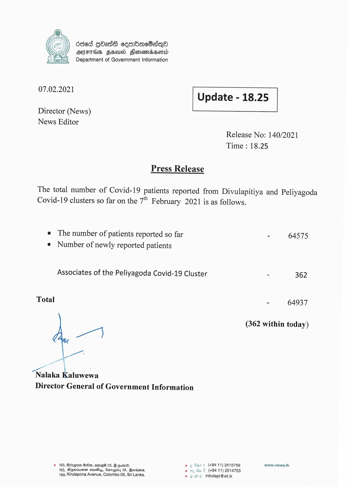

# Press Release - 2021.02.07 
Key: 626ee2359c540d26a42682922cac97de 

---
```
6868 GOadE cesrbacOsdqO
ATITHS FSU Sonowmssord
Department of Government Information

 

 

07.02.2021 Update - 18.25

 

 

 

Director (News)
News Editor

Release No: 140/2021
Time : 18.25

Press Release

The total number of Covid-19 patients reported from Divulapitiya and Peliyagoda
Covid-19 clusters so far on the 7” February 2021 is as follows.

e The number of patients reported so far - 64575
e Number of newly reported patients

Associates of the Peliyagoda Covid-19 Cluster - 362

Total - 64937

(362 within today)

we")

Nalaka Paeeea
Director General of Government Information

© 163, Bozgow 8280, emre® 05, § Go. e © Gat (49411) 2515759 wow.news.tk
163, Agertume seve, Garapidy 05, Beonins. em Su f (+94 11) 2514753
163, Kirulapona Avenue, Colombo 05, Sri Lanka. © 6 He infodept@stt.ik

```
