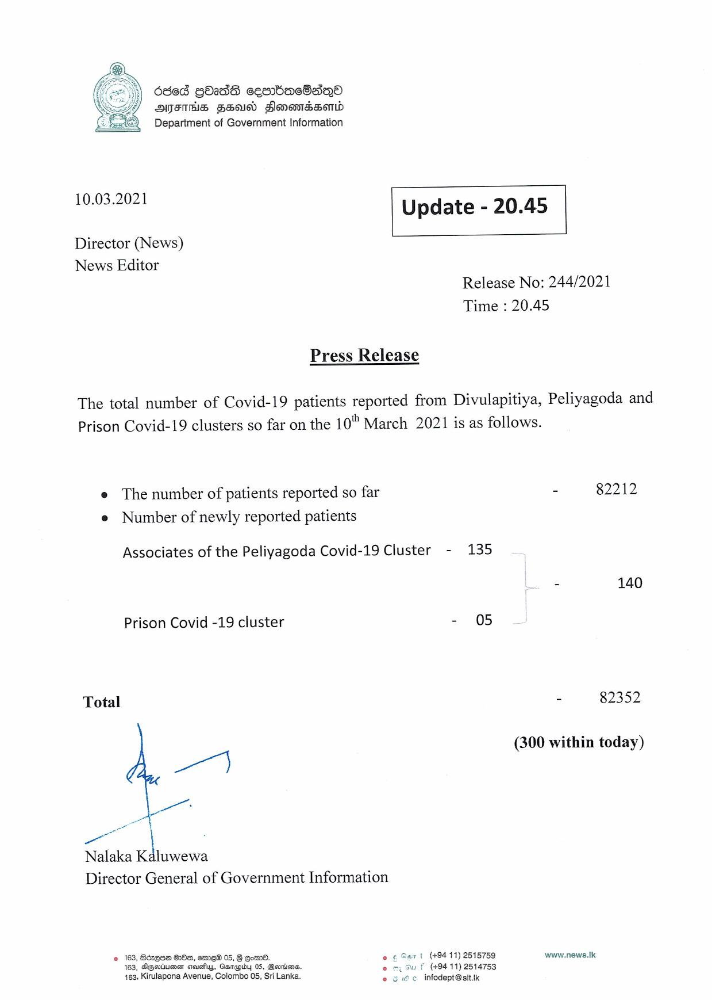

# Press Release - 2021.03.10 
Key: 627decabf33ad20006c050962e3b2b01 

---
```
6ded GO2dS cesrbacSsno
DIFTHS FH Honowndsaend
Department of Government Information

10.03.2021 Update - 20.45

Director (News)
News Editor

 

 

Release No: 244/2021
Time : 20.45

Press Release

The total number of Covid-19 patients reported from Divulapitiya, Peliyagoda and
Prison Covid-19 clusters so far on the 10" March 2021 is as follows.

e The number of patients reported so far - 82212
e Number of newly reported patients

Associates of the Peliyagoda Covid-19 Cluster - 135

= 140

Prison Covid -19 cluster - 05

Total - 82352

(300 within today)

a’

a
Nalaka Kaluwewa

Director General of Government Information

2 163, Bezgse GOs, ome 05, B eo.
163, DGeriumen seushus, Gerapidy 05, Bersiens.
163, Kirulapona Avenue, Colombo 05, Sri Lanka,

(+94 11) 2515759 www.news.Ik
(+94 11) 2514753
e infodept@sit.ik

 

 

```
