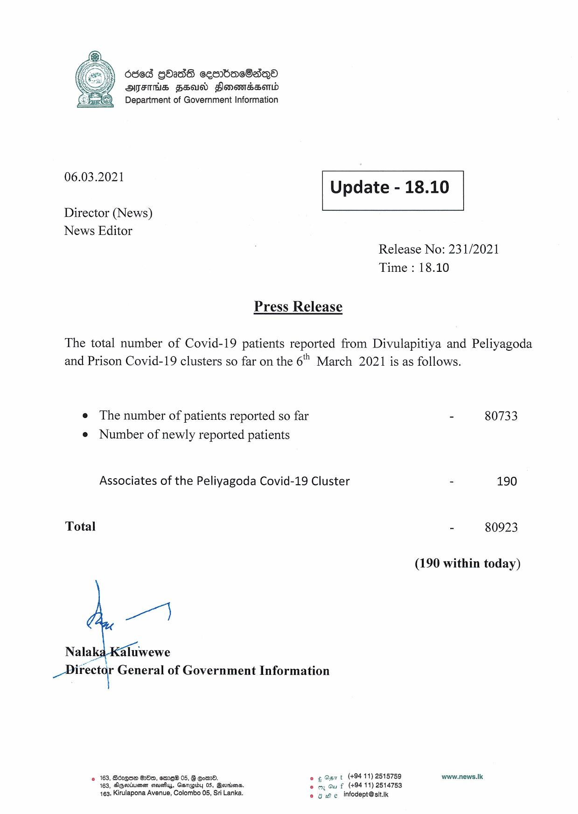

# Press Release - 2021.03.06 
Key: 631cbe3067882fd6d731d0617328e30c 

---
```
| d86d GOadS cesrbaeSs—Qo
AHIFTHS FEUD Slonewdssemd
Department of Government Information

 

 

06.03.2021

 

Update - 18.10

 

 

Director (News)
News Editor

Release No: 231/2021
Time : 18.10

Press Release

The total number of Covid-19 patients reported from Divulapitiya and Peliyagoda
and Prison Covid-19 clusters so far on the 6" March 2021 is as follows.

e The number of patients reported so far
e Number of newly reported patients

Associates of the Peliyagoda Covid-19 Cluster

Total

Pa

Nalal aluwewe
adel General of Government Information

© 163, Bdzqsm Oo, emre® 05, G Goer. e ¢ Gar t (+9411) 2515759
163, Ageriuene stouctius, Garupiby 05, Berrins. © oy Gu f (+94 11) 2514753
163, Kirulapona Avenue, Colombo 05, Sri Lanka. © owe infodept@sit.k

- 80733

5 190

- 80923

(190 within today)

www.news.k

```
