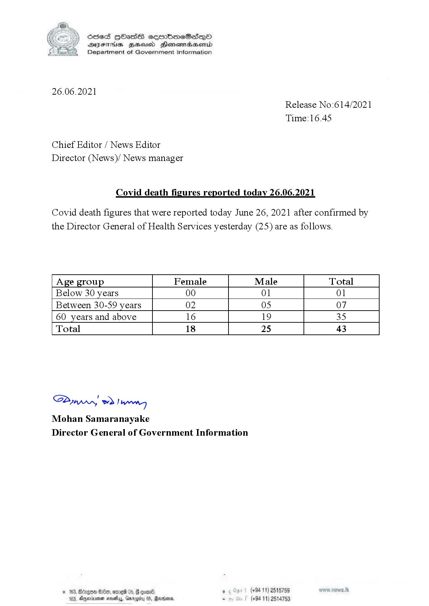

# Press Release - 2021.06.26 - Covid 19 infection deaths 
Key: 633f388026e50163f626bcf49872db1c 

---
```
(6 ) dcsed HbHass cermbm~eSadeQo
S DIsFHsS BHsusd Henewmiaaentd
Department of Government Information

 

26.06.2021
Release No:614/2021

Time:16.45

Chief Editor / News Editor
Director (News)/ News manager

Covid death figures reported today 26.06.2021

Covid death figures that were reported today June 26, 2021 after confirmed by
the Director General of Health Services yesterday (25) are as follows.

 

 

 

 

 

Age group Female Male Total
Below 30 years 00 01 01
Between 30-59 years 02 05 07
60 years and above 16 19 35
Total 18 25 43

 

 

 

 

 

 

SP od Ianwng
Mohan Samaranayake
Director General of Government Information

NED 0 06) . (+94 11) 2515759
44, Gargtty 05, Martone, . (+94 11) 2514753

   

3, Agerniean s

```
