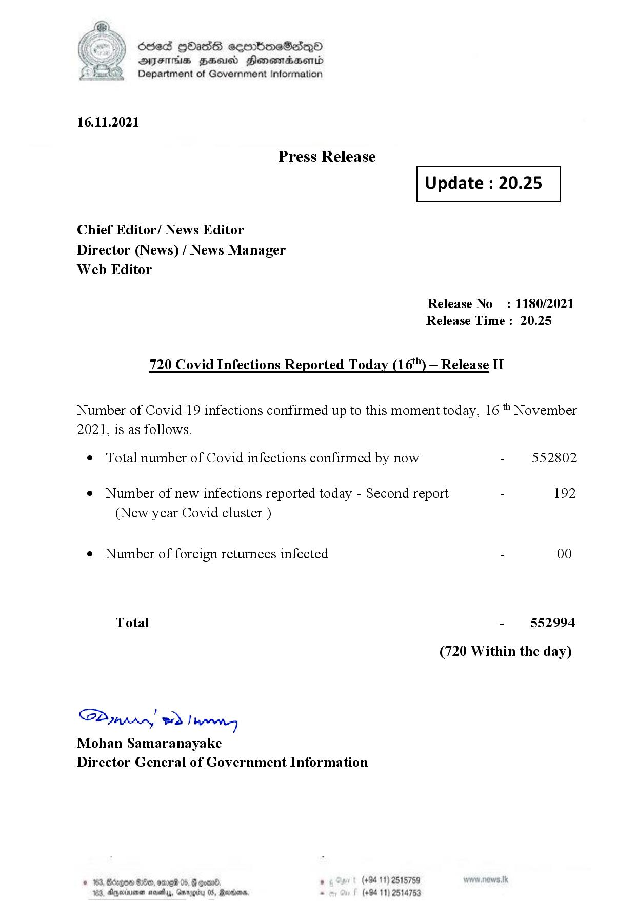

# Press Release - 2021.11.16 - Covid 19 Infection Report 
Key: 6408e380059063d6c719f87fcc82138a 

---
```
dosed GOass eemmbmeSadepO
DFS BHU Honswnradasentd
Department of Government Information

 

 

16.11.2021

Press Release

Chief Editor/ News Editor
Director (News) / News Manager
Web Editor

 

 

Update : 20.25

 

 

Release No

: 1180/2021

Release Time : 20.25

720 Covid Infections Reported Today (16) — Release II

Number of Covid 19 infections confirmed up to this moment today, 16 November

2021, is as follows.

¢ Total number of Covid infections confirmed by now

¢ Number of new infections reported today - Second report

(New year Covid cluster )

¢ Number of foreign returnees infected

Total

SP nprrn wd Ianwng
Mohan Samaranayake
Director General of Government Information

GOD 100, omg 05
Doyerinsonen snevetyy, Garo

   

(+94 11) 2515759
(+94 11) 2514753

552802

192

00

552994

(720 Within the day)

```
