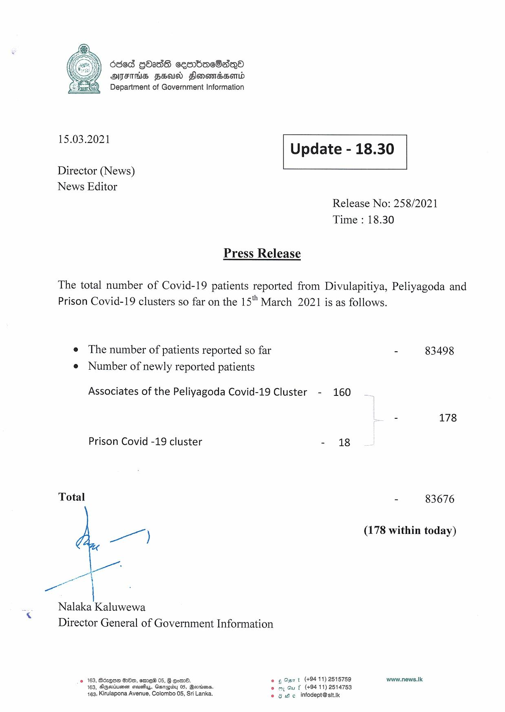

# Press Release - 2021.03.15 
Key: 64f3c17513cc9d27f10b5d53cd5a28ea 

---
```
   

6868 gbadS cebac8aqQo
4) OETHS FHad Sonesmndssomd
Department of Government Information

 

15.03.2021 Update - 18.30

 

 

 

Director (News)
News Editor

Release No: 258/2021
Time : 18.30

Press Release

The total number of Covid-19 patients reported from Divulapitiya, Peliyagoda and
Prison Covid-19 clusters so far on the 15"" March 2021 is as follows.

e The number of patients reported so far - 83498
e Number of newly reported patients

Associates of the Peliyagoda Covid-19 Cluster - 160

. 178
Prison Covid -19 cluster - 18
Total - 83676
a (178 within today)
wee
wee
Nalaka Kaluwewa

Director General of Government Information

© 163, B6zQ62 8280, ame 05, § Goad. © Opn t (#94 11) 2515759 www.news.lk:
163, DAgevtuesn covey, Garapidy 05, Bevriians, © my Gu f (+94 11) 2514753
163, Kirulapona Avenue, Colombo 05, Sri Lanka. © 8 He. infodept@stt.ik

```
