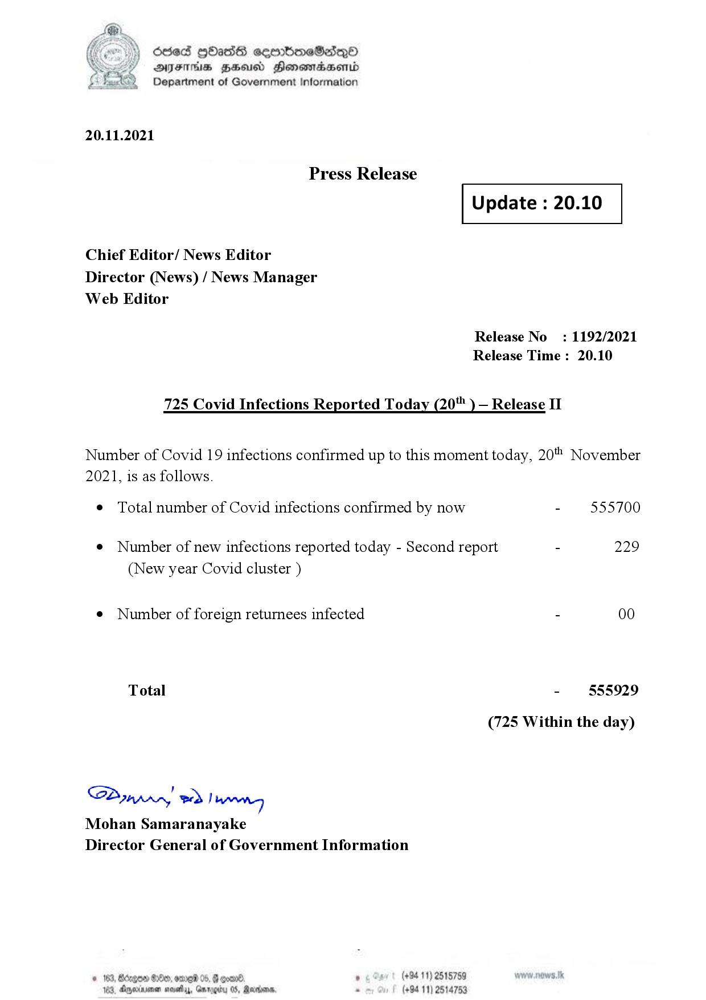

# Press Release - 2021.11.20 - Covid 19 Infection Report 
Key: 650037b1ac958aa4c90c80def691a6ef 

---
```
dosed GOass eemmbmeSadepO
DFS BHU Honswnradasentd
Department of Government Information

 

 

20.11.2021

Press Release

 

Update : 20.10

 

 

 

Chief Editor/ News Editor
Director (News) / News Manager
Web Editor

Release No: 1192/2021
Release Time : 20.10

725 Covid Infections Reported Today (20 ) — Release II

Number of Covid 19 infections confirmed up to this moment today, 20" November
2021, is as follows.

¢ Total number of Covid infections confirmed by now - 555700

¢ Number of new infections reported today - Second report - 229
(New year Covid cluster )

¢ Number of foreign returnees infected - 00
Total - 555929
(725 Within the day)

SP nprrn wd Ianwng
Mohan Samaranayake
Director General of Government Information

(+94 11) 2515759
(+94 11) 2514753

GOD 100, omg 05
Doyerinsonen snevetyy, Garo

   

```
