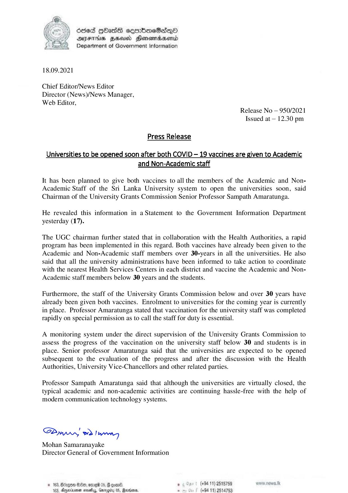

# Press Release - 2021.09.18 - Universities to be opened soon after both COVID 19 vaccines are given to Academic and Non - Academic staff 
Key: 65b13eaff2e3903d808bd09e0bc621d9 

---
```
dded GOass cermmboeSadqQo
AJFTHIS HHU SHonemadasenrd
Department of Government Information

 

18.09.2021

Chief Editor/News Editor
Director (News)/News Manager,
Web Editor,
Release No — 950/2021
Issued at — 12.30 pm

Press Release

Universities to be opened soon after both COVID — 19 vaccines are given to Academic
and Non-Academic staff

It has been planned to give both vaccines to all the members of the Academic and Non-
Academic Staff of the Sri Lanka University system to open the universities soon, said
Chairman of the University Grants Commission Senior Professor Sampath Amaratunga.

 

He revealed this information in a Statement to the Government Information Department
yesterday (17).

The UGC chairman further stated that in collaboration with the Health Authorities, a rapid
program has been implemented in this regard. Both vaccines have already been given to the
Academic and Non-Academic staff members over 30-years in all the universities. He also
said that all the university administrations have been informed to take action to coordinate
with the nearest Health Services Centers in each district and vaccine the Academic and Non-
Academic staff members below 30 years and the students.

 

Furthermore, the staff of the University Grants Commission below and over 30 years have
already been given both vaccines. Enrolment to universities for the coming year is currently
in place. Professor Amaratunga stated that vaccination for the university staff was completed
rapidly on special permission as to call the staff for duty is essential.

A monitoring system under the direct supervision of the University Grants Commission to
assess the progress of the vaccination on the university staff below 30 and students is in
place. Senior professor Amaratunga said that the universities are expected to be opened
subsequent to the evaluation of the progress and after the discussion with the Health
Authorities, University Vice-Chancellors and other related parties.

Professor Sampath Amaratunga said that although the universities are virtually closed, the
typical academic and non-academic activities are continuing hassle-free with the help of
modern communication technology systems.

 

SPywwwy > Ian
Mohan Samaranayake
Director General of Government Information

», . (+94 11) 2515759 warn. news tk
188, Aarinenen sath, Garogiu 05, Rann. . (+94 11) 2514753

 

```
