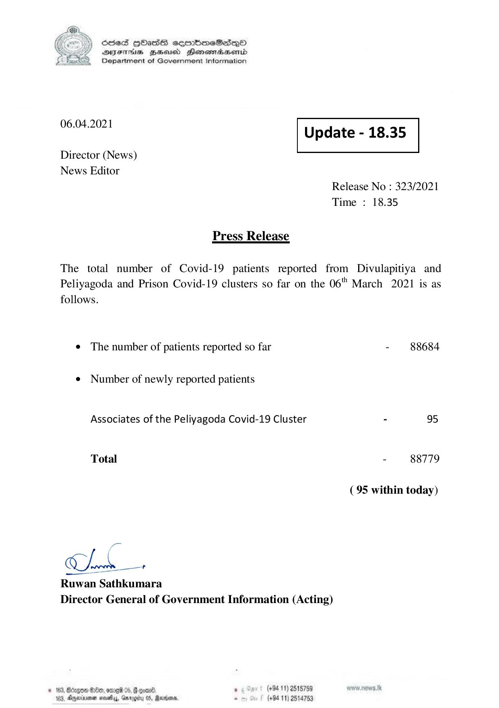

# Press Release - 2021.04.06 
Key: 66f6fb69dc37c482edc607a66b0e124a 

---
```
) ScdeS HOadS cermbmeSsdQo
DVFIHS BHU Henewiaentd
Department of Government Information

 

 

06.04.2021

 

Update - 18.35

 

 

Director (News)
News Editor

Release No : 323/2021
Time : 18.35

Press Release

The total number of Covid-19 patients reported from Divulapitiya and
Peliyagoda and Prison Covid-19 clusters so far on the 06" March 2021 is as

follows.

¢ The number of patients reported so far

¢ Number of newly reported patients
Associates of the Peliyagoda Covid-19 Cluster

Total

—

Ok oe

Ruwan Sathkumara
Director General of Government Information (Acting)

© 163, Gorgon 80, ome 05, § coan® , (+94 11) 2515759
183, Anarene maethys, Garogiby 05, Mercian - (+94 11) 2514753

- 88684

- 88779

(95 within today)

```
