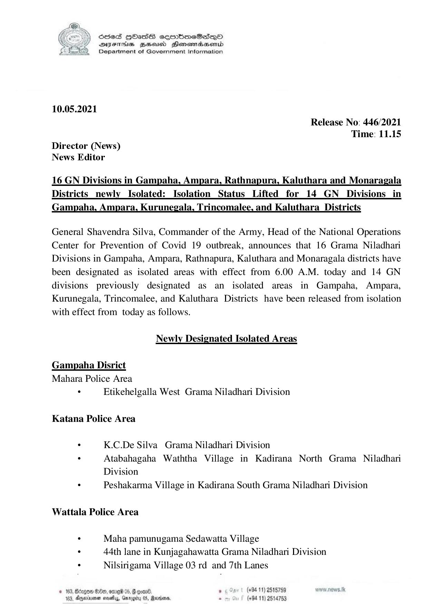

# Press Release - 2021.05.10 - Isolated lifting and newly isolated areas 
Key: 67ea87054be8f84781126beaf3676ace 

---
```
S865 HOasS eqrmbmeSs—oO
DFTs BHousd Henombaend
Department of Government Information

 

10.05.2021

Release No: 446/2021
Time: 11.15
Director (News)
News Editor

16 GN Divisions in Gampaha, Ampara, Rathnapura, Kaluthara and Monaragala
Districts_newly Isolated: Isolation _Status_Lifted_for_14 GN _Divisions_in

Gampaha, Ampara, Kurunegala, Trincomalee, and Kaluthara_Districts

General Shavendra Silva, Commander of the Army, Head of the National Operations
Center for Prevention of Covid 19 outbreak, announces that 16 Grama Niladhari
Divisions in Gampaha, Ampara, Rathnapura, Kaluthara and Monaragala districts have
been designated as isolated areas with effect from 6.00 A.M. today and 14 GN
divisions previously designated as an isolated areas in Gampaha, Ampara,
Kurunegala, Trincomalee, and Kaluthara Districts have been released from isolation
with effect from today as follows.

Newly Designated Isolated Areas
Gampaha Disrict
Mahara Police Area
: Etikehelgalla West Grama Niladhari Division

Katana Police Area

. K.C.De Silva Grama Niladhari Division
. Atabahagaha Waththa Village in Kadirana North Grama Niladhari

Division
. Peshakarma Village in Kadirana South Grama Niladhari Division
Wattala Police Area
: Maha pamunugama Sedawatta Village
. 44th lane in Kunjagahawatta Grama Niladhari Division

. Nilsirigama Village 03 rd and 7th Lanes

© 183, Bdagem 90, ore 05, G ooan®. . (+94 11) 2515759
103. Agmivmen wombs, Garb 05, Marden. . (+94 11) 2514753

```
