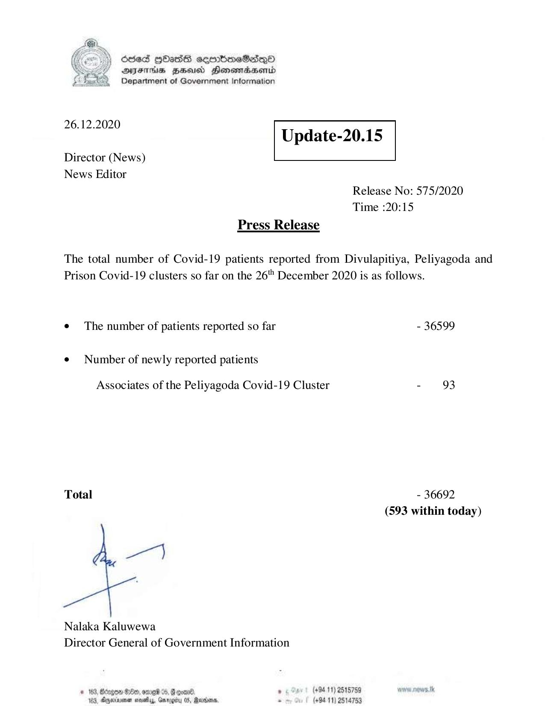

# Press Release - 2020.12.26 
Key: 689d2114245c5eb57e76e77c634df537 

---
```
6563 HOHasG sembmcSasqQo
DAJFITAs BHU Honomrdbsertd
Department of Government Information

 

 

26.12.2020
Update-20.15

 

 

 

Director (News)
News Editor
Release No: 575/2020
Time :20:15
Press Release

The total number of Covid-19 patients reported from Divulapitiya, Peliyagoda and
Prison Covid-19 clusters so far on the 26" December 2020 is as follows.
¢ The number of patients reported so far - 36599

¢ Number of newly reported patients

Associates of the Peliyagoda Covid-19 Cluster - 93

Total - 36692
(593 within today)

Nalaka Kaluwewa
Director General of Government Information

# 168, Bergen Oe, ome 05, Goven®, , (+8411) 2515759
123, Aneoinrenan neve, Gmrogiby 0S, Marnoans. s (+9411) 2514753

```
