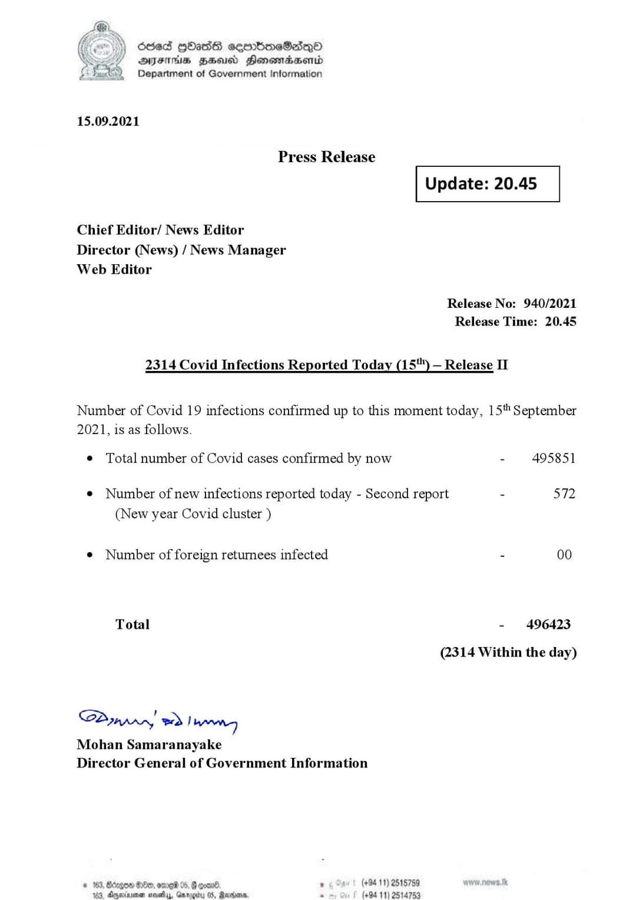

# Press Release - 2021.09.15 - Covid 19 Infection Report 
Key: 68d6cec7ac823fe1b348e5ffcf163f50 

---
```
Scied GOs eqmmbimeSedeO
AIFS HHS Honemrdaertd
Department of Government Information

 

15.09.2021

Press Release

Update: 20.45

 

Chief Editor/ News Editor
Director (News) / News Manager
Web Editor

Release No: 940/2021
Release Time: 20.45

2314 Covid Infections Reported Today (15"") — Release II

Number of Covid 19 infections confirmed up to this moment today, 15" September
2021, is as follows.

¢ Total number of Covid cases confirmed by now - 495851

© Number of new infections reported today - Second report - 572
(New year Covid cluster )

© Number of foreign returnees infected - 00
Total - 496423
(2314 Within the day)

Sdynrr, wd Tannen
Mohan Samaranayake
Director General of Government Information

© 163, Borgen De, ome 05, G con®. , (+94 11) 2515789 wow news tik
104. neinme sasly, Gargéy 05, Panne. s (+94 11) 2514753

```
