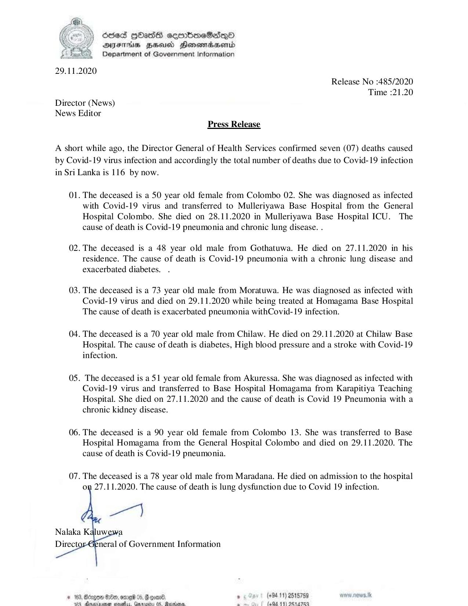

# Press Release - 2020.11.29 - 07 Covid 19 infection deaths has been reported ,total deaths rises to 116 
Key: 69079cea4cf12566bb36db40a1e56c48 

---
```
Ose HbastS sembmeSesqQoO
DAIFHs HEU Honomasentd
Department of Government Information

 

29.11.2020
Release No :485/2020
Time :21.20
Director (News)
News Editor
Press Release

A short while ago, the Director General of Health Services confirmed seven (07) deaths caused
by Covid-19 virus infection and accordingly the total number of deaths due to Covid-19 infection
in Sri Lanka is 116 by now.

01. The deceased is a 50 year old female from Colombo 02. She was diagnosed as infected
with Covid-19 virus and transferred to Mulleriyawa Base Hospital from the General
Hospital Colombo. She died on 28.11.2020 in Mulleriyawa Base Hospital ICU. The
cause of death is Covid-19 pneumonia and chronic lung disease. .

02. The deceased is a 48 year old male from Gothatuwa. He died on 27.11.2020 in his
residence. The cause of death is Covid-19 pneumonia with a chronic lung disease and
exacerbated diabetes.

03. The deceased is a 73 year old male from Moratuwa. He was diagnosed as infected with
Covid-19 virus and died on 29.11.2020 while being treated at Homagama Base Hospital
The cause of death is exacerbated pneumonia withCovid-19 infection.

04. The deceased is a 70 year old male from Chilaw. He died on 29.11.2020 at Chilaw Base
Hospital. The cause of death is diabetes, High blood pressure and a stroke with Covid-19
infection.

OS. The deceased is a 51 year old female from Akuressa. She was diagnosed as infected with
Covid-19 virus and transferred to Base Hospital Homagama from Karapitiya Teaching
Hospital. She died on 27.11.2020 and the cause of death is Covid 19 Pneumonia with a
chronic kidney disease.

06. The deceased is a 90 year old female from Colombo 13. She was transferred to Base
Hospital Homagama from the General Hospital Colombo and died on 29.11.2020. The
cause of death is Covid-19 pneumonia.

07. The deceased is a 78 year old male from Maradana. He died on admission to the hospital
on 27.11.2020. The cause of death is lung dysfunction due to Covid 19 infection.

 

   
  

ED, ODOT %, good. . (+9411) 2515759 woww.nows.tk
an miacels, Cmoastins OS Gost a (004-11) O8a7RO

© 163, Beg
wa dmexa:

```
