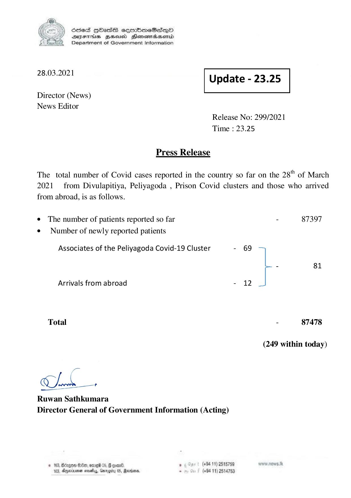

# Press Release - 2021.03.28 
Key: 697c78ff67cfc86c145a9e916a96a533 

---
```
) ScdeS HOadS cermbmeSsdQo
DVEFIHS HHosd Honomabsenid
Department of Government Information

 

 

28.03.2021

 

Update - 23.25

 

 

Director (News)
News Editor

Release No: 299/2021
Time : 23.25

Press Release

The total number of Covid cases reported in the country so far on the 28" of March
2021 from Divulapitiya, Peliyagoda , Prison Covid clusters and those who arrived

from abroad, is as follows.
e The number of patients reported so far
¢ Number of newly reported patients

Associates of the Peliyagoda Covid-19 Cluster -

Arrivals from abroad -

Total

oe

Gh —,

Ruwan Sathkumara
Director General of Government Information (Acting)

«163, Bago ®t, 26 05, & ooan® . (+94 11) 2515759
104, Dggeriienen nosey, Gmrogity 05, Reanim, . (+94 11) 2514753

- 87397
69
- 81
12
- 87478
(249 within today)

```
