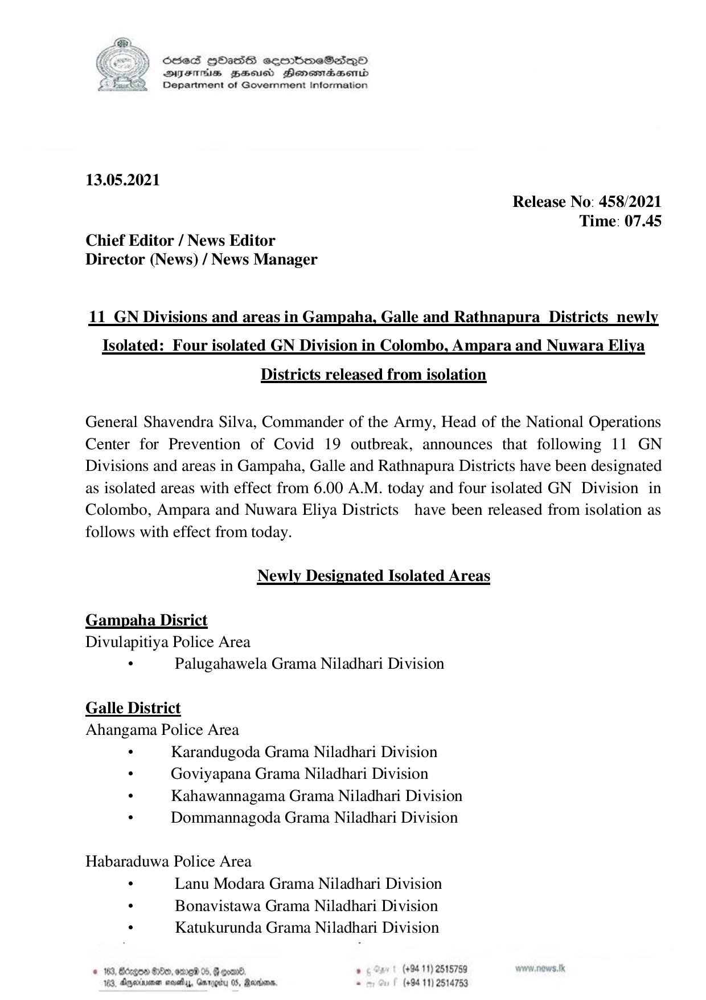

# Press Release - 2021.05.13 - Released from isolation and Newly designated Isolated Areas 
Key: 6a3fde92cf08503766565a3b241ca456 

---
```
S865 HOasS eqrmbmeSs—oO
DFTs BHousd Henombaend
Department of Government Information

 

13.05.2021

Release No: 458/2021
Time: 07.45
Chief Editor / News Editor
Director (News) / News Manager

11_GN Divisions and areas in Gampaha, Galle and Rathnapura_ Districts newly
Isolated: Four isolated GN Division in Colombo, Ampara and Nuwara Eliya

Districts released from isolation

General Shavendra Silva, Commander of the Army, Head of the National Operations
Center for Prevention of Covid 19 outbreak, announces that following 11 GN
Divisions and areas in Gampaha, Galle and Rathnapura Districts have been designated
as isolated areas with effect from 6.00 A.M. today and four isolated GN Division in
Colombo, Ampara and Nuwara Eliya Districts have been released from isolation as
follows with effect from today.

Newly Designated Isolated Areas

Gampaha Disrict
Divulapitiya Police Area

. Palugahawela Grama Niladhari Division
Galle District
Ahangama Police Area
: Karandugoda Grama Niladhari Division
. Goviyapana Grama Niladhari Division
. Kahawannagama Grama Niladhari Division
. Dommannagoda Grama Niladhari Division

Habaraduwa Police Area

. Lanu Modara Grama Niladhari Division
. Bonavistawa Grama Niladhari Division

. Katukurunda Grama Niladhari Division

. (+94 11) 2515759

© 183, Béc;gon Ge, ome? 05, ,
Ramm. - (+94 11) 2514753

16. Damier nev, Gar

 

 

```
