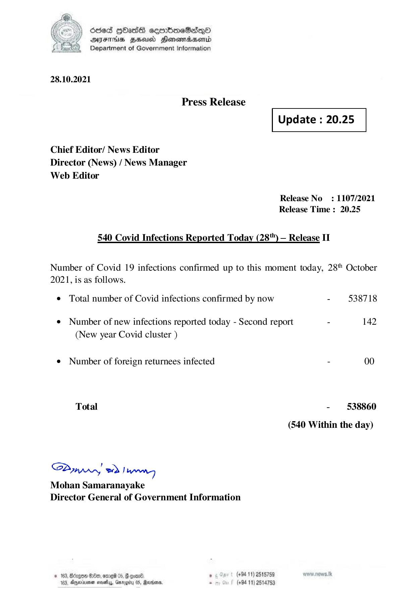

# Press Release  - 2021.10.28 - Covid 19 Infection Report 
Key: 6b07794971ebf2ad8bd5e81ea69e0e89 

---
```
) died Gass ceembeSsdqQo
DFS BHU Honswnradasentd
2 Department of Government Information

   

28.10.2021

Press Release

 

Update : 20.25

 

 

 

Chief Editor/ News Editor
Director (News) / News Manager
Web Editor

Release No: 1107/2021
Release Time : 20.25

540 Covid Infections Reported Today (28") — Release IT

Number of Covid 19 infections confirmed up to this moment today, 28" October
2021, is as follows.

¢ Total number of Covid infections confirmed by now - 538718
¢ Number of new infections reported today - Second report - 142
(New year Covid cluster )
e¢ Number of foreign returnees infected - 00
Total - 538860
(540 Within the day)

Saar eed Joanng
Mohan Samaranayake
Director General of Government Information

© 163, Beizgoe S00, ore 05, # goane ° (#94 11) 2518789
163, Aparna seseiy, Gnrogiry 05, Ravens, - (+94 11) 2514753

```
