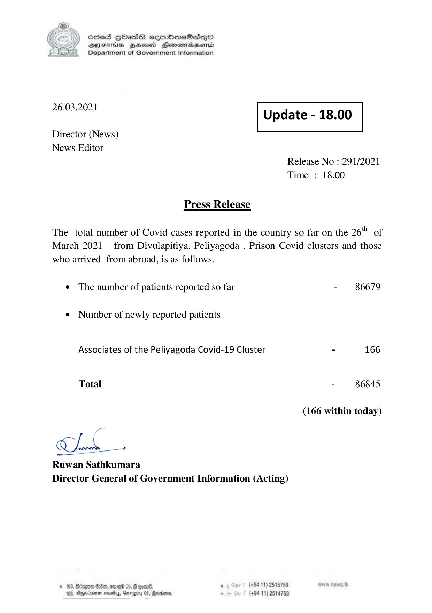

# Press Release - 2021.03.26 
Key: 6b4617c316a5aae347a6c21daaeb408a 

---
```
) ScdeS HOadS cermbmeSsdQo
DVEFIHS HHosd Honomabsenid
Department of Government Information

 

 

26.03.2021 Update - 18.00

 

 

 

Director (News)
News Editor

Release No : 291/2021
Time : 18.00

Press Release

The total number of Covid cases reported in the country so far on the 26" of
March 2021 from Divulapitiya, Peliyagoda , Prison Covid clusters and those

who arrived from abroad, is as follows.
¢ The number of patients reported so far

¢ Number of newly reported patients
Associates of the Peliyagoda Covid-19 Cluster

Total

Ch —

Ruwan Sathkumara
Director General of Government Information (Acting)

© 163, Bcagon B80, ore 05, # gone , (+84 11) 2515759
163, Aparna sosty, Garggitu 05, Rana, - (+94 11) 2514753

- 86679

- 166

- 86845,

(166 within today)

```
