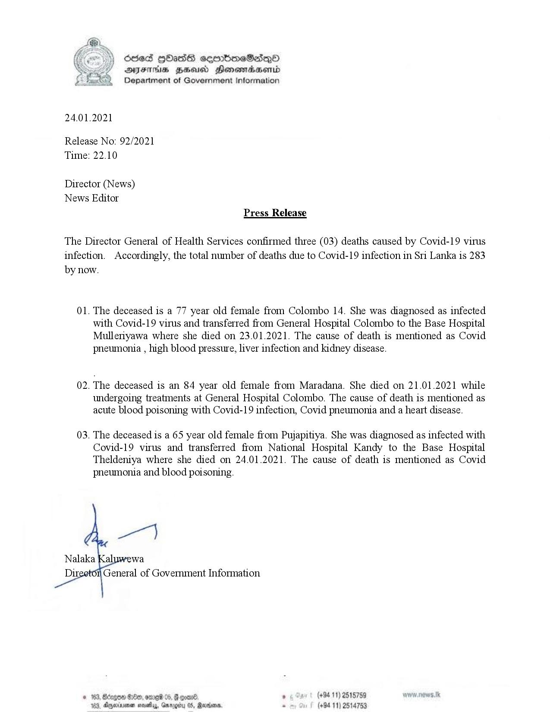

# Press Release - 2021.01.24 - Covid 19 infection deaths 
Key: 6b520746c74abe7a768cac9636a7d891 

---
```
oded HOasG cembmeSadqoO
DAJFIS BHU Honomasentd
Department of Government Information

 

24.01.2021

Release No: 92/2021
Time: 22.10

Director (News)
News Editor
Press Release

The Director General of Health Services confirmed three (03) deaths caused by Covid-19 virus
infection. Accordingly, the total number of deaths due to Covid-19 infection in Sri Lanka is 283
by now.

01. The deceased is a 77 year old female from Colombo 14. She was diagnosed as infected
with Covid-19 virus and transferred from General Hospital Colombo to the Base Hospital
Mulleriyawa where she died on 23.01.2021. The cause of death is mentioned as Covid
pneumonia , high blood pressure, liver infection and kidney disease.

02. The deceased is an 84 year old female from Maradana. She died on 21.01.2021 while
undergoing treatments at General Hospital Colombo. The cause of death is mentioned as
acute blood poisoning with Covid-19 infection, Covid pneumonia and a heart disease.

03. The deceased is a 65 year old female from Pujapitiya. She was diagnosed as infected with
Covid-19 virus and transferred from National Hospital Kandy to the Base Hospital
Theldeniya where she died on 24.01.2021. The cause of death is mentioned as Covid
pneumonia and blood poisoning.

   

General of Government Information.

. (+94 11) 2515759 81k
. (+94 11) 2514753

© 163, Bdegon S80, ore 05, Foo
163, Dggernenen mosey, Groot

 

```
