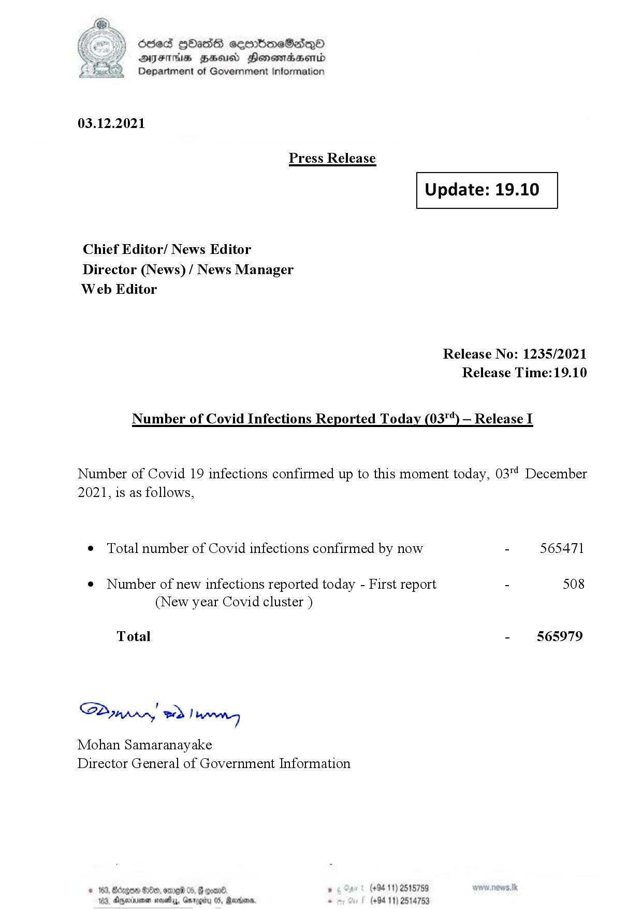

# Press Release - 2021.12.03 
Key: 6bb8dfc68ca8ea3c59786b5cdef354f8 

---
```
(oe) Sed QOass cerrbroeSadqQo
DFS HHS Honsmnadaerntd
Department of Government Information

 

03.12.2021

Press Release

 

Update: 19.10

 

 

 

Chief Editor/ News Editor
Director (News) / News Manager
Web Editor

Release No: 1235/2021
Release Time:19.10

Number of Covid Infections Reported Today (03"*) — Release I

Number of Covid 19 infections confirmed up to this moment today, 03' December
2021, is as follows,

¢ Total number of Covid infections confirmed by now - 565471

¢ Number of new infections reported today - First report - 508
(New year Covid cluster )

Total - 565979

Sa mprn! wd! wong

Mohan Samaranayake
Director General of Government Information

ant 5 (+94 11) 2515789
05, Rana. - (+84 11) 25

 
 

© 163, Bdrgon Ge, ome 05, F
163, Aparna sosehyy, Gnr

  

```
