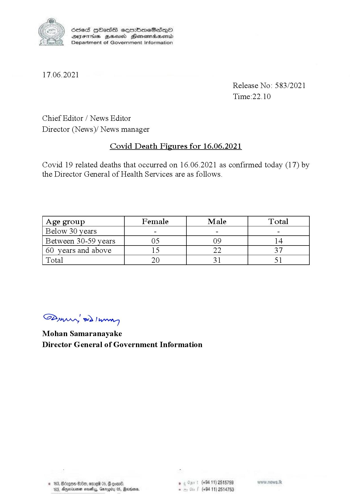

# Press Release - 2021.06.17- Covid 19 infection deaths 
Key: 6c0214f382826271e36b618d86a92b78 

---
```
(6 S) ScseS HOasdS cerrbmeSdQo
DFTs BHEosd Henewtaeasernid
Department of Government Information

 

17.06.2021

Chief Editor / News Editor
Director (News)/ News manager

Covid Death Figures for 16.06.2021

Release No: 583/2021
Time:22.10

Covid 19 related deaths that occurred on 16.06.2021 as confirmed today (17) by

the Director General of Health Services are as follows.

 

 

 

 

 

 

 

 

 

 

Age group Female Male Total
Below 30 years - - -
Between 30-59 years 05 09 14
60 years and above 15 22 37
Total 20 31 51

 

SAmwwy 2) wong
Mohan Samaranayake
Director General of Government Information

 

© 163, Bdzgoa Oe, ome 05,

163, Dnexirsonan novellas, Gn

 

. (+94 11) 2515759
(+94 11) 2514753

```
