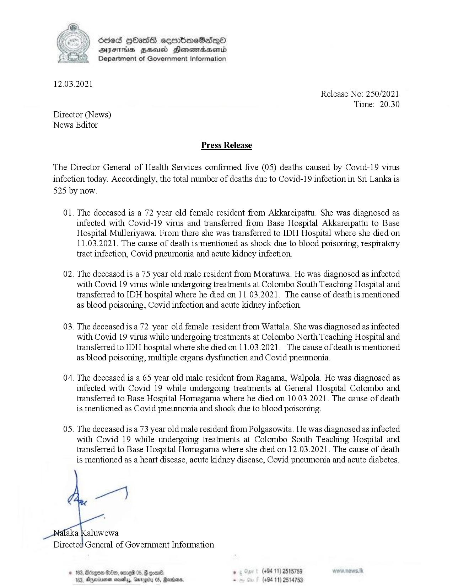

# Press Release - 2021.03.12 - Covid 19 infection deaths 
Key: 6c037c27e9d53ec32c87313ccfc97e63 

---
```
 

S8ed HHass semboneSasqQo®
DFIHUS BHU Honesrcaerid
Department of Government Information

12.03.2021

Release No: 250/2021
Time: 20.30

Director (News)
News Editor

Press Release

The Director General of Health Services confirmed five (05) deaths caused by Covid-19 virus
infection today. Accordingly, the total number of deaths due to Covid-19 infection in Sri Lanka is
525 by now.

01.

02.

03.

04.

0S.

 

The deceased is a 72 year old female resident from Akkareipattu. She was diagnosed as
infected with Covid-19 virus and transferred from Base Hospital Akkareipattu to Base
Hospital Mulleriyawa. From there she was transferred to IDH Hospital where she died on
11.03.2021. The cause of death is mentioned as shock due to blood poisoning, respiratory
tract infection, Covid pneumonia and acute kidney infection.

The deceased is a 75 year old male resident from Moratuwa. He was diagnosed as infected
with Covid 19 virus while undergoing treatments at Colombo South Teaching Hospital and
transferred to IDH hospital where he died on 11.03.2021. The cause of death is mentioned
as blood poisoning, Covid infection and acute kidney infection.

The deceased is a 72 year old female resident from Wattala. She was diagnosed as infected
with Covid 19 virus while undergoing treatments at Colombo North Teaching Hospital and
transferred to IDH hospital where she died on 11.03.2021. The cause of death is mentioned
as blood poisoning, multiple organs dysfunction and Covid pneumonia.

The deceased is a 65 year old male resident from Ragama, Walpola. He was diagnosed as
infected with Covid 19 while undergoing treatments at General Hospital Colombo and
transferred to Base Hospital Homagama where he died on 10.03.2021. The cause of death
is mentioned as Covid pneumonia and shock due to blood poisoning.

The deceased is a 73 year old male resident from Polgasowita. He was diagnosed as infected
with Covid 19 while undergoing treatments at Colombo South Teaching Hospital and
transferred to Base Hospital Homagama where she died on 12.03.2021. The cause of death
is mentioned as a heart disease, acute kidney disease, Covid pneumonia and acute diabetes.

. (+94 11) 2515759
(+94 11) 2514753

```
