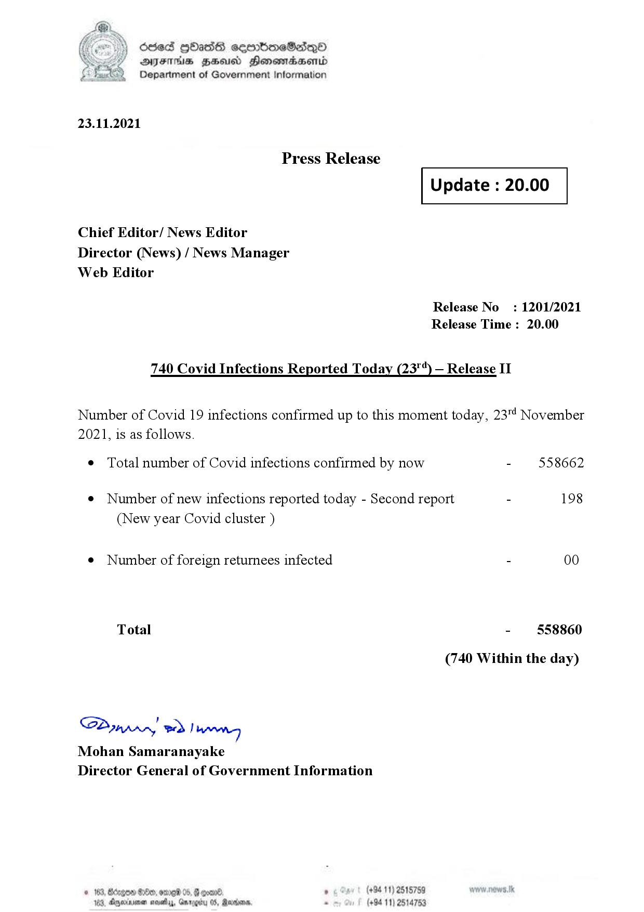

# Press Release - 2021.11.23 - Covid 19 Infection Report 
Key: 6d3cf017f99822a7c1e622930e22dabc 

---
```
dosed GOass eemmbmeSadepO
DFS BHU Honswnradasentd
Department of Government Information

 

 

23.11.2021

Press Release

Chief Editor/ News Editor
Director (News) / News Manager
Web Editor

 

 

Update : 20.00

 

 

Release No

: 1201/2021

Release Time : 20.00

740 Covid Infections Reported Today (23") — Release II

Number of Covid 19 infections confirmed up to this moment today, 23"! November

2021, is as follows.

¢ Total number of Covid infections confirmed by now

¢ Number of new infections reported today - Second report -

(New year Covid cluster )

¢ Number of foreign returnees infected

Total

SP nprrn wd Ianwng
Mohan Samaranayake
Director General of Government Information

GOD 100, omg 05
Doyerinsonen snevetyy, Garo

   

(+94 11) 2515759
(+94 11) 2514753

558662

198

00

558860

(740 Within the day)

```
