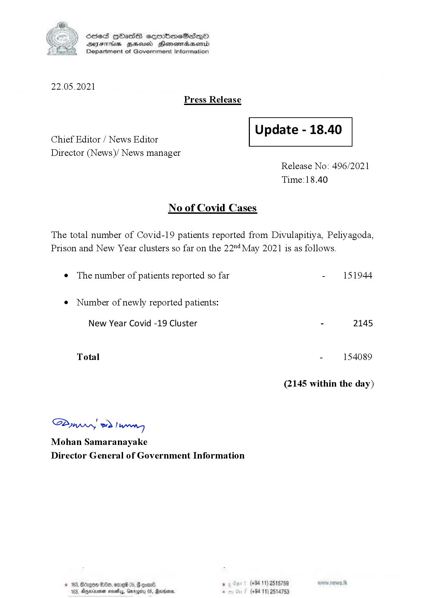

# Press Release - 2021.05.22 
Key: 6dfd6ea3fdf576078c33182ff7e13357 

---
```
S) ScseS HOasdS cerrbmeSdQo
DFTs BHEosd Henewtaeasernid
Department of Government Information

 

22.05.2021

Press Release

 

—— Update - 18.40
Chief Editor / News Editor

Director (News)/ News manager

 

 

 

Release No: 496/2021
Time:18.40

No of Covid Cases

The total number of Covid-19 patients reported from Divulapitiya, Peliyagoda,
Prison and New Year clusters so far on the 22"! May 2021 is as follows.

¢ The number of patients reported so far - 151944

¢ Number of newly reported patients:

New Year Covid -19 Cluster - 2145

Total - 154089
(2145 within the day)
Saw 2) wn

Mohan Samaranayake
Director General of Government Information

53, 8 De, org 05, @ oem ’ (+94 11) 2515789
4, Drperinimnen mosey, Gmrogrty 0S, Mornin = (+94 11) 2514753

 

```
