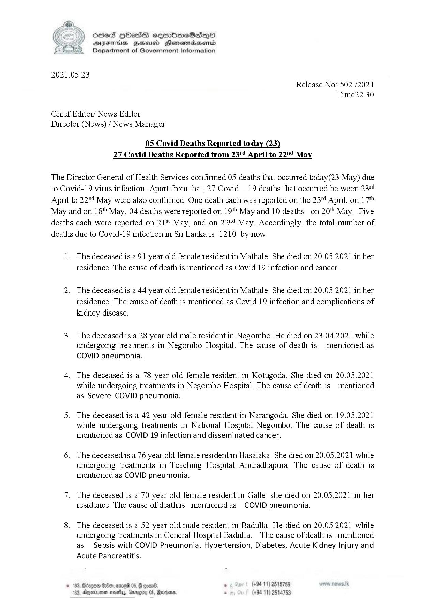

# Press Release - 2021.05.23 - Covid 19 infection deaths 
Key: 6f7218cea8d10576e9139c4d55ff99d7 

---
```
 

Sed Hbass seembmeSese—p©O
DIF BHusd Henemadaenrd
Department of Government Information

2021.05.23

Release No: 502 /2021
Time22.30

Chief Editor/ News Editor
Director (News) / News Manager

05 Covid Deaths Reported today (23)
27 Covid Deaths Reported from 23" April to 22"! May

The Director General of Health Services confirmed 05 deaths that occurred today(23 May) due
to Covid-19 virus infection. Apart from that, 27 Covid — 19 deaths that occurred between 23"¢
April to 22" May were also confirmed. One death each was reported on the 23" April, on 17"
May and on 18" May. 04 deaths were reported on 19 May and 10 deaths on 20" May. Five
deaths each were reported on 21*t May, and on 22"4 May. Accordingly, the total number of
deaths due to Covid-19 infection in Sri Lanka is 1210 by now.

.

. The deceased is a91 year old female resident in Mathale. She died on 20.05.2021 in her

residence. The cause of death is mentioned as Covid 19 infection and cancer.

The deceased is a 44 year old female resident in Mathale. She died on 20.05.2021 in her
tesidence. The cause of death is mentioned as Covid 19 infection and complications of
kidney disease.

The deceased is a 28 year old male resident in Negombo. He died on 23.04.2021 while
undergoing treatments in Negombo Hospital. The cause of death is mentioned as
COVID pneumonia.

The deceased is a 78 year old female resident in Kotugoda. She died on 20.05.2021
while undergoing treatments in Negombo Hospital. The cause of death is mentioned
as Severe COVID pneumonia.

The deceased is a 42 year old female resident in Narangoda. She died on 19.05.2021
while undergoing treatments in National Hospital Negombo. The cause of death is
mentioned as COVID 19 infection and disseminated cancer.

The deceased is a 76 year old female resident in Hasalaka. She died on 20.05.2021 while
undergoing treatments in Teaching Hospital Anuradhapura. The cause of death is
mentioned as COVID pneumonia.

The deceased is a 70 year old female resident in Galle. she died on 20.05.2021 in her
tesidence. The cause of deathis mentionedas COVID pneumonia.

The deceased is a 52 year old male resident in Badulla. He died on 20.05.2021 while
undergoing treatments in General Hospital Badulla. The cause ofdeathis mentioned
as Sepsis with COVID Pneumonia. Hypertension, Diabetes, Acute Kidney Injury and
Acute Pancreatitis.

. (+94 11) 2515759
S, Rodos, . (+94 11) 2514753

163, Boxgos ore 05. &
163, Aggerirenan sevetys, GarrogH

  
 

```
