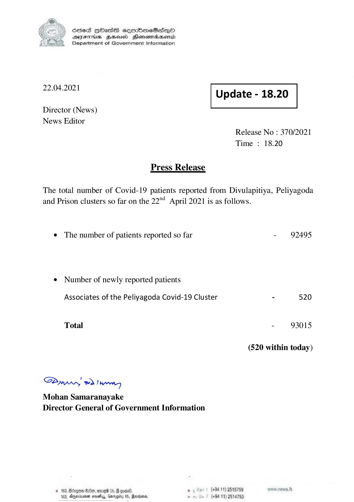

# Press Release - 2021.04.22 
Key: 6f7b2d49dc540c209d4643cf0cf8a8d1 

---
```
) ScdeS HOadS cermbmeSsdQo
DVEFIHS HHosd Honomabsenid
Department of Government Information

 

 

22.04.2021 Update - 18.20

 

 

 

Director (News)

News Editor
Release No : 370/2021
Time : 18.20

Press Release
The total number of Covid-19 patients reported from Divulapitiya, Peliyagoda

and Prison clusters so far on the 22° April 2021 is as follows.

e The number of patients reported so far - 92495

¢ Number of newly reported patients

Associates of the Peliyagoda Covid-19 Cluster - 520
Total - 93015.
(520 within today)

Saw eo) wn,
Mohan Samaranayake
Director General of Government Information

© 163, Bdagen $:0t0, e160 05, 8 omn8. . (+94 11) 2518759
103, Agpeinenar sesety, Garogiy 05, Rerianas - (+94 11) 2514753

```
