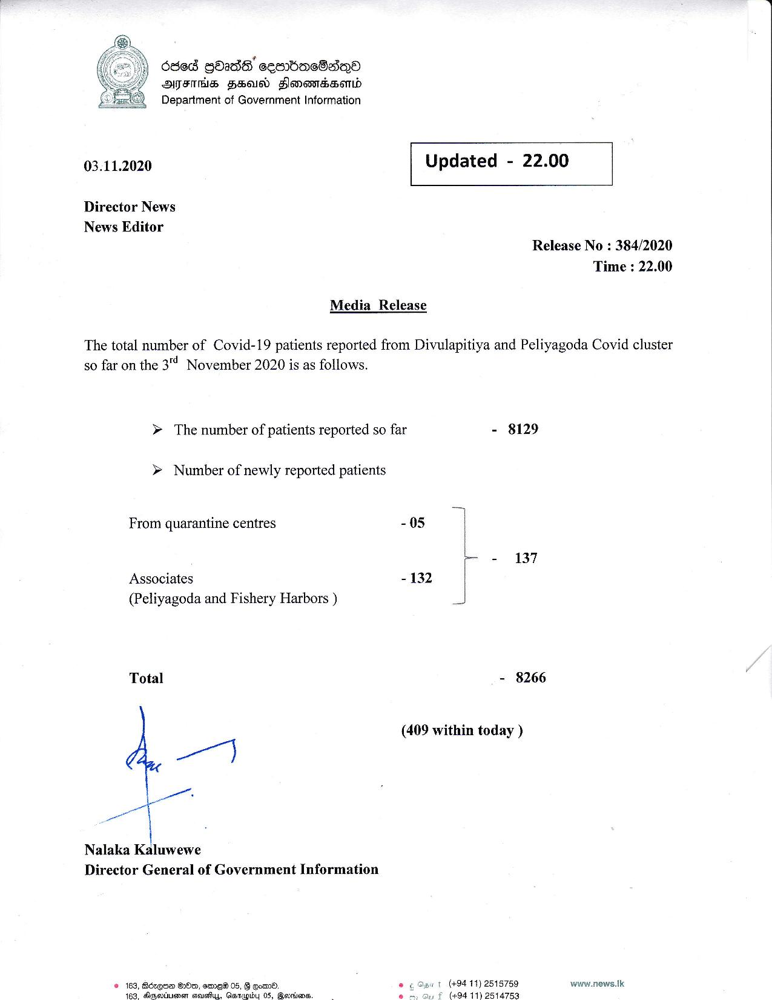

# Press Release - 2020.11.03 
Key: 7010b475bb0c5eb6002f88bdea997eb7 

---
```
ded gbadS eemnbac8aqn®
HATFTHS FeO Sonoda
Department of Government Information

 

03.11.2020

Director News
News Editor

 

Updated - 22.00

 

 

 

Release No : 384/2020
Time : 22.00

Media Release

The total number of Covid-19 patients reported from Divulapitiya and Peliyagoda Covid cluster

so far on the 31 November 2020 is as follows.

> The number of patients reported so far

> Number of newly reported patients

From quarantine centres

Associates
(Peliyagoda and Fishery Harbors )

Total

 

Nalaka Kaluwewe

Director General of Government Information

© 163, Bdxqne Om, eme® 05, 8 gom®
46g. dicpectuenen seuss, Gasp 05, @adena:

- 8129

- 05 :

- - 137
- 132 |

J

- 8266

(409 within today )
@ ¢ Gant (+9411) 2518759 www.news.|k

 

£ (494 11) 2514753

 

```
