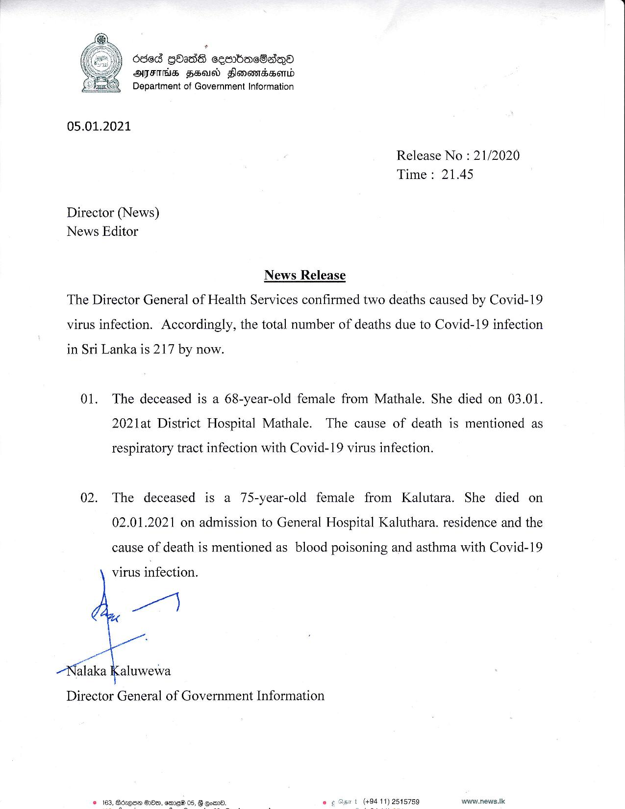

# Press Release - 2021.01.05- 2covid 19 deaths reported - total 217 
Key: 715b4a2cf1f2186363a67fb980d7c26d 

---
```
ddd Qbads cembacSaqQa
ATFITHS FSA Flonowmdssomd
Department of Government Information

 

05.01.2021
Release No : 21/2020
Time: 21.45
Director (News)
News Editor

News Release
The Director General of Health Services confirmed two deaths caused by Covid-19
virus infection. Accordingly, the total number of deaths due to Covid-19 infection

in Sri Lanka is 217 by now.

01. The deceased is a 68-year-old female from Mathale. She died on 03.01.
2021at District Hospital Mathale. The cause of death is mentioned as

respiratory tract infection with Covid-19 virus infection.

02. The deceased is a 75-year-old female from Kalutara. She died on
02.01.2021 on admission to General Hospital Kaluthara. residence and the
cause of death is mentioned as blood poisoning and asthma with Covid-19

virus infection.

lt

Be

Malaka Kaluwewa

Director General of Government Information

 

© 163, Bosqee OOe, amrew® 05, G gor. . (+94 11) 2515759 www.news.lk

 

```
