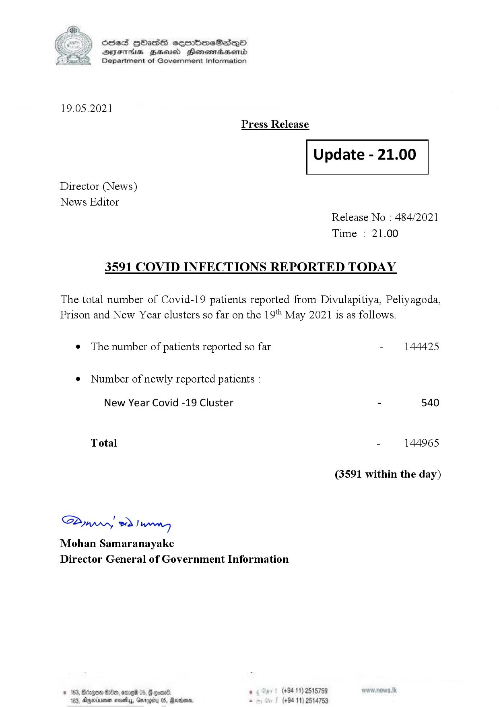

# Press Release - 2021.05.19 - Covid 19 infection report 
Key: 71d747de35f4fb6f113212f461662654 

---
```
S) ScseS HOasdS cerrbmeSdQo
DFTs BHEosd Henewtaeasernid
Department of Government Information

 

19.05.2021
Press Release

 

Update - 21.00

 

 

 

Director (News)

News Editor
Release No : 484/2021
Time : 21.00

3591 COVID INFECTIONS REPORTED TODAY

The total number of Covid-19 patients reported from Divulapitiya, Peliyagoda,
Prison and New Year clusters so far on the 19" May 2021 is as follows.

e The number of patients reported so far - 144425

¢ Number of newly reported patients :

New Year Covid -19 Cluster - 540
Total - 144965
(3591 within the day)

Syw ed) wenn
Mohan Samaranayake
Director General of Government Information

 

© 163, Bdrgow He, amr 05, oom . (+94 11) 2515759
163, Dggeriremen mosey, Gmrggity 08, Reisen, . (+94 11) 2514753

```
