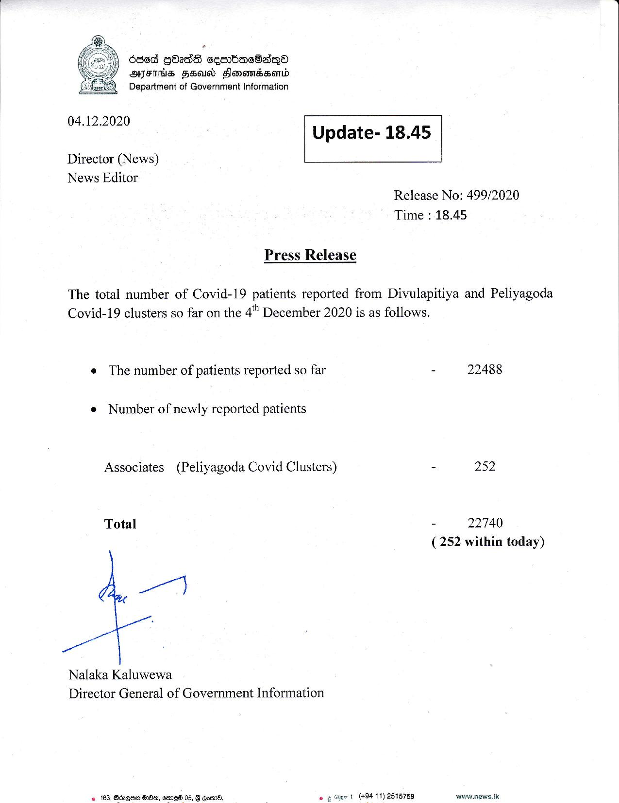

# Press Release - 2020.12.04 
Key: 720fb79a3755099ba8014430ed702157 

---
```
  

686d GdadS cesrbacBsQeo
OFS FHA Slenomdsond
Department of Government Information

Ee
’

04.12.2020

 

Update- 18.45

 

 

Director (News)
News Editor

 

Release No: 499/2020
Time : 18.45

Press Release

The total number of Covid-19 patients reported from Divulapitiya and Peliyagoda
Covid-19 clusters so far on the 4" December 2020 is as follows.

e The number of patients reported so far - 22488

e Number of newly reported patients

Associates (Peliyagoda Covid Clusters) - 252
Total - 22740
(252 within today)

a

Nalaka Kaluwewa
Director General of Government Information

¢ 163, Bécqte G20, ame 05, 8 Gem. eg art (+8411) 2515759 www.news.k

```
