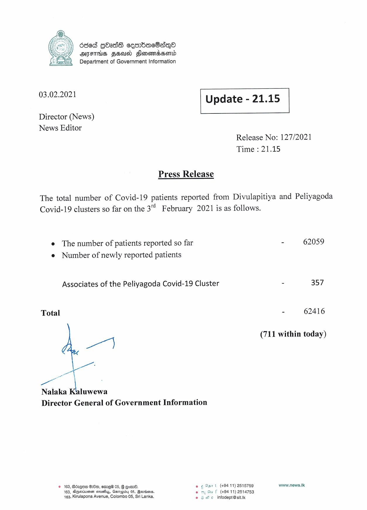

# Press Release - 2021.02.03 
Key: 721a51e5a145310e65f5462228dcecf2 

---
```
| ded gbade cembacSaqQo
AIFS FEUD Slonomadsond
Department of Government Information

 

 

03.02.2021

 

Update - 21.15

 

 

Director (News)
News Editor

Release No: 127/2021
Time : 21.15

Press Release

The total number of Covid-19 patients reported from Divulapitiya and Peliyagoda
Covid-19 clusters so far on the 3 February 2021 is as follows.

e The number of patients reported so far
e Number of newly reported patients

Associates of the Peliyagoda Covid-19 Cluster

Total
a At
Nalaka Kaluwewa

Director General of Government Information

© 163, Advgow 260, eme®@ 05, G Eom. eo 6 57 t (+9411) 2515759
163, Depsotiisn steve, Ganagiby 05, erties. wf (494 11) 2514753
163; Kirulapona Avenue, Colombo 05, Sri Lanka. © 5 we infodept@sit.ik

 

- 62059

= 357

- 62416

(711 within today)

www.news.Ik

```
