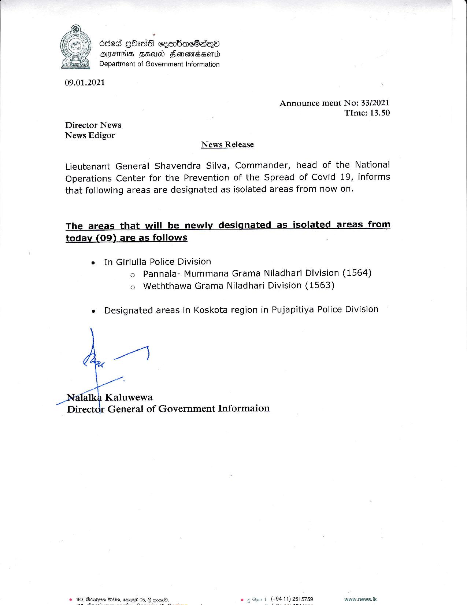

# Press Release - 2021.01.09 - Isolation lifting & newly isolated areas 
Key: 73149b690ba8e16a17abe2e3729c0cdb 

---
```
6865 GOadS ceombacSaiQa
AFTHS FEU Flomomnssomd
Department of Government Information

 

09.01.2021

Announce ment No: 33/2021
TIme: 13.50
Director News
News Edigor
News Release

 

Lieutenant General Shavendra Silva, Commander, head of the National
Operations Center for the Prevention of the Spread of Covid 19, informs
that following areas are designated as isolated areas from now on.

The_ areas that will be newly designated as isolated areas from
today (09) are as follows

 

e In Giriulla Police Division
o Pannala- Mummana Grama Niladhari Division (1564)
o Weththawa Grama Niladhari Division (1563)

e Designated areas in Koskota region in Pujapitiya Police Division

4-7

_Nalalka Kaluwewa
Pech i General of Government Informaion

   

www.news.Ik

 

```
