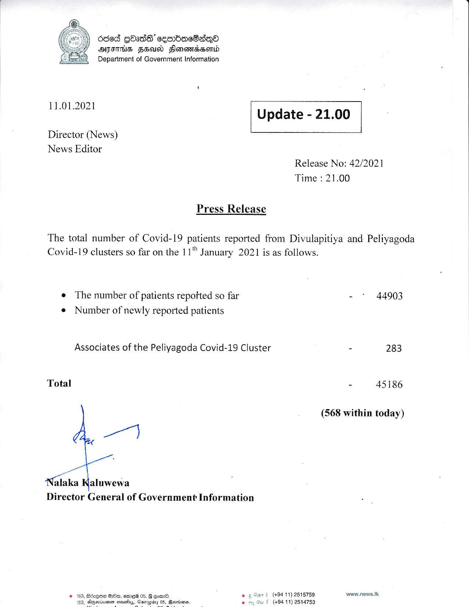

# Press Release - 2021.01.11 
Key: 739f0eb3ed5667d59561660cf8e212f6 

---
```
6868 GOas’ ceenbaeSaq®
AMIE HEAD Sonewidsond
Department of Government Information

 

 

11.01.2021 Update - 21.00

 

 

 

Director (News)

News Editor
Release No: 42/2021
Time : 21.00

Press Release

The total number of Covid-19 patients reported from Divulapitiya and Peliyagoda
Covid-19 clusters so far on the 11" January 2021 is as follows.

© The number of patients repofted so far - * 44903
e Number of newly reported patients

Associates of the Peliyagoda Covid-19 Cluster - 283

Total - 45186

(568 within today)

wy

SP

Nalaka aluwewa
Director General of Government Information

Bocqee Gd, eme® 05, 8 eom. © Or | (+94 11) 2515759 www.news.tk
Horiiushen soussys, Gasruployy 05, Booriisnas (+94 11) 2514753

    

 

```
