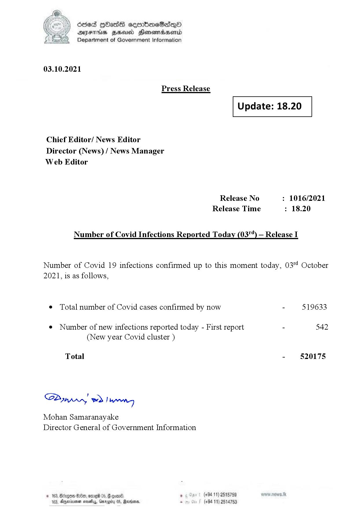

# Press Release - 2021.10.03 
Key: 73ca1224db1aebd337942850c2d5dec3 

---
```
(oe) Sed QOass cerrbroeSadqQo
DFS HHS Honsmnadaerntd
Department of Government Information

 

03.10.2021

Press Release

 

Update: 18.20

 

 

 

Chief Editor/ News Editor
Director (News) / News Manager
Web Editor

Release No : 1016/2021
Release Time : 18.20

Number of Covid Infections Reported Today (03"*) — Release I

Number of Covid 19 infections confirmed up to this moment today, 03™ October
2021, is as follows,

¢ Total number of Covid cases confirmed by now - 519633

¢ Number of new infections reported today - First report - 542
(New year Covid cluster )

Total - 520175

Sa mprn! wd! wong

Mohan Samaranayake
Director General of Government Information

° (+94 11) 2515759
(+94 11) 2514753

 

```
