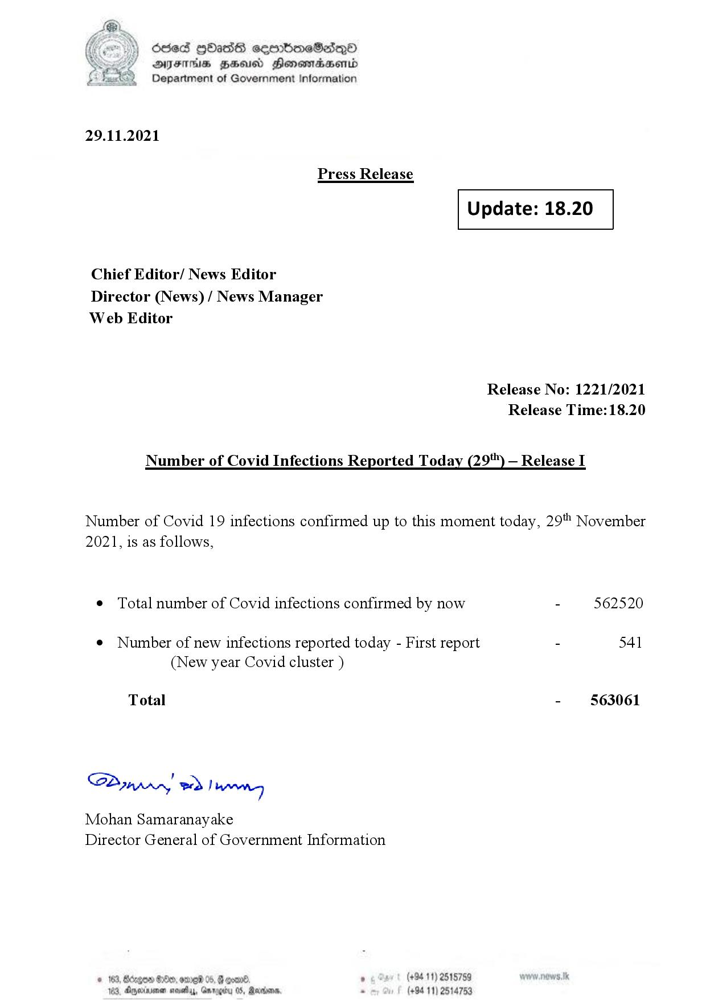

# Press Release - 2021.11.29 
Key: 73ebcd5704b0ada770c26fe162b35f69 

---
```
(oe) Sed QOass cerrbroeSadqQo
DFS HHS Honsmnadaerntd
Department of Government Information

 

29.11.2021

Press Release

 

Update: 18.20

 

 

 

Chief Editor/ News Editor
Director (News) / News Manager
Web Editor

Release No: 1221/2021
Release Time: 18.20

Number of Covid Infections Reported Today (29'") — Release I

Number of Covid 19 infections confirmed up to this moment today, 29" November

2021, is as follows,

¢ Total number of Covid infections confirmed by now - 562520

¢ Number of new infections reported today - First report - 541
(New year Covid cluster )

-  §63061

Total

Sa mprn! wd! wong

Mohan Samaranayake
Director General of Government Information

 
 

© 163, Bago G00, ore 05, # one , (+94 11) 2515789
183, Dryerinemen sovethys, Ga . (+94 11) 25

  

05, Rearions,

```
