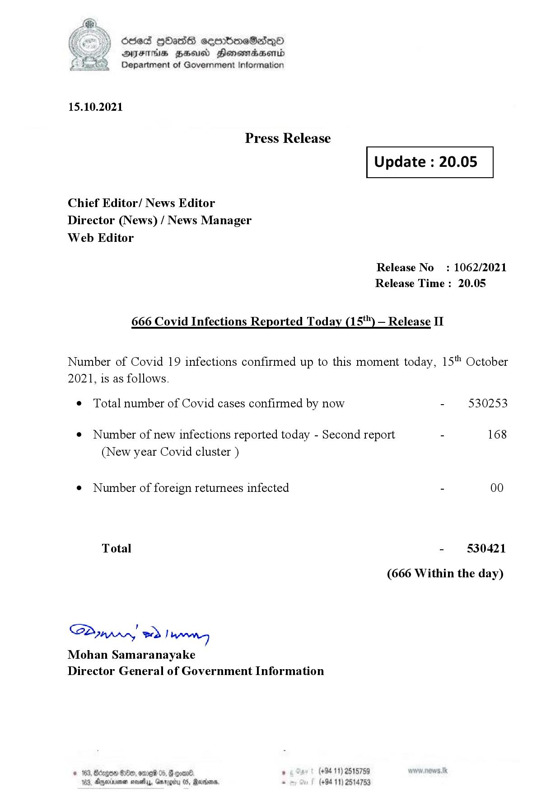

# Press Release - 2021.10.15 - Covid 19 Infection Report 
Key: 749b1982c3b83592c6377bc084428d0c 

---
```
dosed GOass eemmbmeSadepO
DFS BHU Honswnradasentd
Department of Government Information

 

 

15.10.2021

Press Release

Chief Editor/ News Editor
Director (News) / News Manager
Web Editor

 

 

Update : 20.05

 

 

Release No: 1062/2021
Release Time : 20.05

666 Covid Infections Reported Today (15") — Release II

Number of Covid 19 infections confirmed up to this moment today, 15" October

2021, is as follows.

¢ Total number of Covid cases confirmed by now

¢ Number of new infections reported today - Second report

(New year Covid cluster )

¢ Number of foreign returnees infected

Total

Sdn) ee f bern
Mohan Samaranayake
Director General of Government Information

 

. (+94 11) 2515759
(+94 11) 2514753

- 530253

168

- 530421
(666 Within the day)

```
