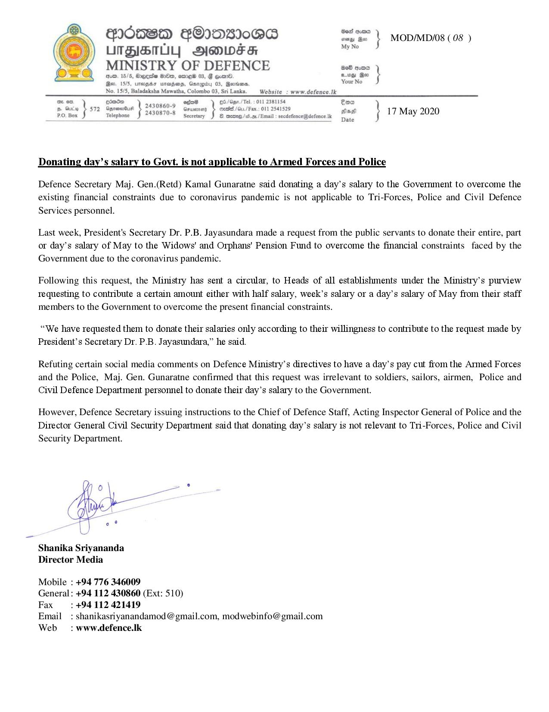

# Press Release - 17.05.2020 -Ministry of Defence 
Key: 7567ed584a1ba79e9f49f12d5950bf4d 

---
```
PIOHSBD GOIWDSIoMB sme's | MODIMDIOS (08 )

 

LUITBISIUL] Sienwes se iste
MINISTRY OF DEFENCE seb oe }
je. t/a hegoto wits, ac 6, @ esas sea |

No. 15/5, Baladaksha Mawatha, Colombo 03, Sri Lanka. _Website_: www.defence.lk

Po, Bex Soe jie Se) amen bes } 17 May 2020

Donating day’s salary to Govt. is not applicable to Armed Forces and Police

 

Defence Secretary Maj. Gen.(Retd) Kamal Gunaratne said donating a day’s salary to the Government to overcome the
existing financial constraints due to coronavirus pandemic is not applicable to Tri-Forces, Police and Civil Defence
Services personnel.

Last week, President's Secretary Dr. P.B. Jayasundara made a request from the public servants to donate their entire, part
or day’s salary of May to the Widows' and Orphans’ Pension Fund to overcome the financial constraints faced by the
Government due to the coronavirus pandemic.

Following this request, the Ministry has sent a circular, to Heads of all establishments under the Ministry’s purview
requesting to contribute a certain amount either with half salary, week’s salary or a day’s salary of May from their staff
members to the Government to overcome the present financial constraints.

“We have requested them to donate their salaries only according to their willingness to contribute to the request made by
President’s Secretary Dr. P.B. Jayasundara,” he said.

Refuting certain social media comments on Defence Ministry’s directives to have a day’s pay cut from the Armed Forces
and the Police, Maj. Gen. Gunaratne confirmed that this request was irrelevant to soldiers, sailors, airmen, Police and
Civil Defence Department personnel to donate their day’s salary to the Government.

However, Defence Secretary issuing instructions to the Chief of Defence Staff, Acting Inspector General of Police and the
Director General Civil Security Department said that donating day’s salary is not relevant to Tri-Forces, Police and Civil
Security Department.

 

Shanika Sriyananda
Director Media

Mobile : +94 776 346009

General : +94 112 430860 (Ext: 510)

Fax =: +94.112 421419

Email : shanikasriyanandamod @ gmail.com, modwebinfo@ gmail.com
Web — : www.defence.Ik

```
