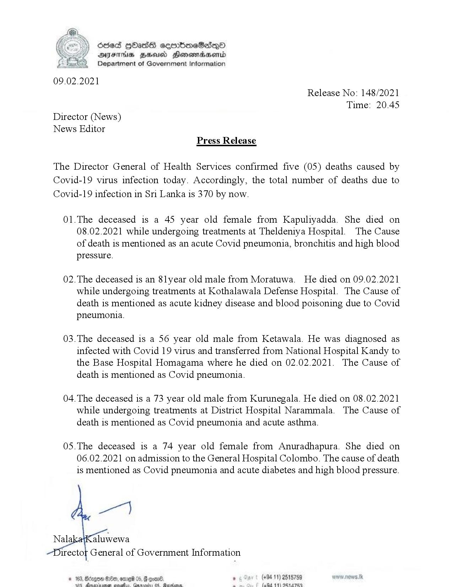

# Press Release - 2021.02.09 - Covid 19 infection deaths 
Key: 75741850a76231fdb3e1734d8d396fc1 

---
```
oes HHasG semmimeSadsQo
DAJITHsS HSS Honomradsenid
Department of Government Information

 

09.02.2021
Release No: 148/2021
Time: 20.45
Director (News)
News Editor
Press Release

The Director General of Health Services confirmed five (05) deaths caused by
Covid-19 virus infection today. Accordingly, the total number of deaths due to
Covid-19 infection in Sri Lanka is 370 by now.

01.The deceased is a 45 year old female from Kapuliyadda. She died on
08.02.2021 while undergoing treatments at Theldeniya Hospital. The Cause
of death is mentioned as an acute Covid pneumonia, bronchitis and high blood
pressure.

02.The deceased is an 8lyear old male from Moratuwa. He died on 09.02.2021
while undergoing treatments at Kothalawala Defense Hospital. The Cause of
death is mentioned as acute kidney disease and blood poisoning due to Covid
pneumonia.

03.The deceased is a 56 year old male from Ketawala. He was diagnosed as
infected with Covid 19 virus and transferred from National Hospital Kandy to
the Base Hospital Homagama where he died on 02.02.2021. The Cause of
death is mentioned as Covid pneumonia.

04. The deceased is a 73 year old male from Kurunegala. He died on 08.02.2021
while undergoing treatments at District Hospital Narammala. The Cause of
death is mentioned as Covid pneumonia and acute asthma.

05.The deceased is a 74 year old female from Anuradhapura. She died on
06.02.2021 on admission to the General Hospital Colombo. The cause of death
is mentioned as Covid pneumonia and acute diabetes and high blood pressure.

 

. (+94 11) 2515759
Pane oe i faQd 11) ORL ATEO

```
