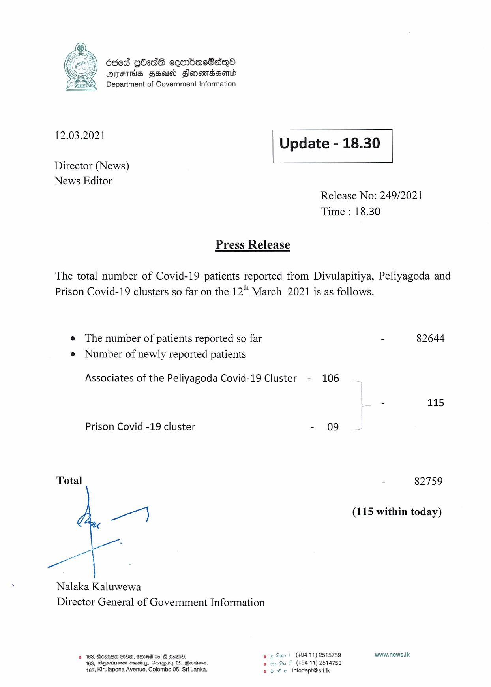

# Press Release - 2021.03.12 
Key: 7644833bbb0f7db8fbc4930ff532f259 

---
```
dded GOaddS cesnbacOaqQe
FINS FHad Honandssonid
Department of Government Information

 

 

12.03.2021 Update - 18.30

 

 

 

Director (News)
News Editor
Release No: 249/2021

Time : 18.30

Press Release

The total number of Covid-19 patients reported from Divulapitiya, Peliyagoda and
Prison Covid-19 clusters so far on the 12"" March 2021 is as follows.

e The number of patients reported so far - 82644
e Number of newly reported patients

Associates of the Peliyagoda Covid-19 Cluster - 106
- 115

Prison Covid -19 cluster - 09

Total - 82759

eo (115 within today)

|

Nalaka Kaluwewa
Director General of Government Information

2 163, Bérese B80, med 05, § Go. fe 6 Aart (+9411) 2518759 www.news.tk.
163, Ageiumen asuafys, Gorpby 05, Berio. (+94 11) 2614753
163, Kirulapona Avenue, Colombo 05, Sri Lanka. ey He infodept@sit.ik

   

```
