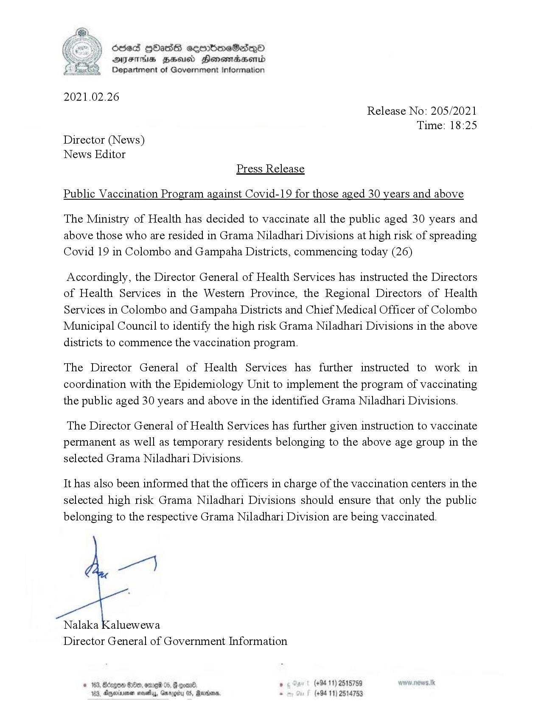

# Press Release - 2021.02.26 - Public Vaccination Program against Covid 19 for those aged 30 years and above 
Key: 766a19f37e959a81f5570f9cdbc22757 

---
```
(Cee) Scsed QOass ceenbmeSedqQ®
2S DQYFHs ZHousd HonowiadaHerd
Department of Government Information

 

2021.02.26
Release No: 205/2021
Time: 18:25
Director (News)
News Editor
Press Release

Public Vaccination Program against Covid-19 for those aged 30 years and above

The Ministry of Health has decided to vaccinate all the public aged 30 years and
above those who are resided in Grama Niladhari Divisions at high risk of spreading
Covid 19 in Colombo and Gampaha Districts, commencing today (26)

Accordingly, the Director General of Health Services has instructed the Directors
of Health Services in the Western Province, the Regional Directors of Health
Services in Colombo and Gampaha Districts and Chief Medical Officer of Colombo
Municipal Council to identify the high risk Grama Niladhari Divisions in the above
districts to commence the vaccination program.

The Director General of Health Services has further instructed to work in
coordination with the Epidemiology Unit to implement the program of vaccinating
the public aged 30 years and above in the identified Grama Niladhari Divisions.

The Director General of Health Services has further given instruction to vaccinate
permanent as well as temporary residents belonging to the above age group in the
selected Grama Niladhari Divisions.

It has also been informed that the officers in charge of the vaccination centers in the
selected high risk Grama Niladhari Divisions should ensure that only the public
belonging to the respective Grama Niladhari Division are being vaccinated.

wer}

Nalaka Kaluewewa
Director General of Government Information

  

x 8:00, ome 05. F goad ,
2, Amine not, Gnregiy 05, Rarien

   

```
