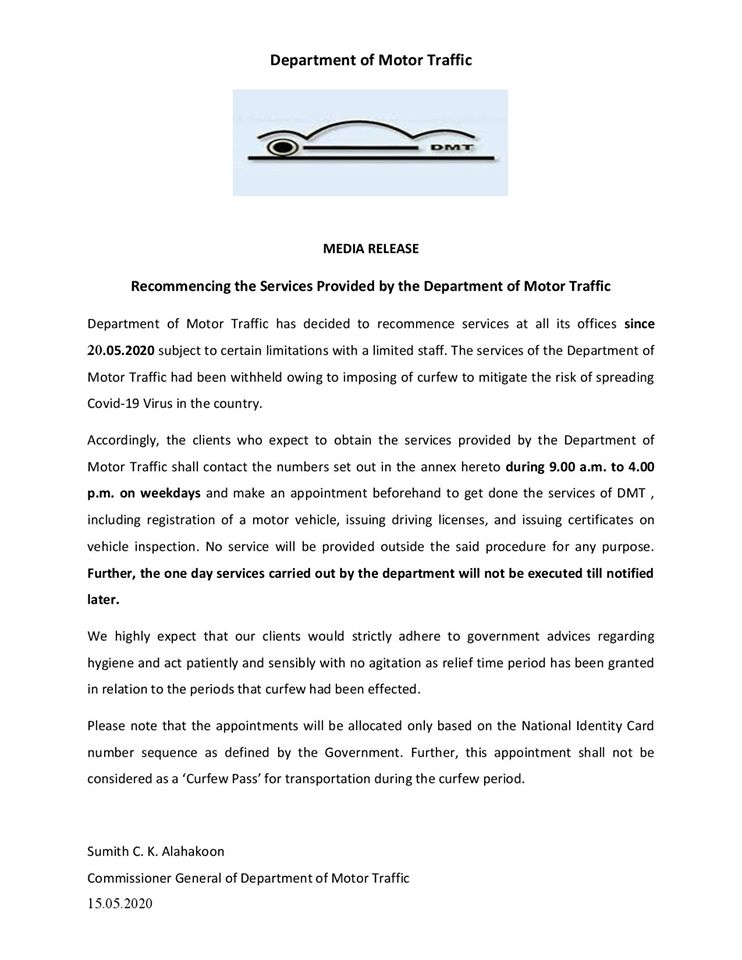

# Press Release - 2020.05.16 - Department of Motor Traffic 
Key: 76cde6a15f6910f4f4d651b6b3057261 

---
```
Department of Motor Traffic

o_o

MEDIA RELEASE
Recommencing the Services Provided by the Department of Motor Traffic

Department of Motor Traffic has decided to recommence services at all its offices since
20.05.2020 subject to certain limitations with a limited staff. The services of the Department of
Motor Traffic had been withheld owing to imposing of curfew to mitigate the risk of spreading

Covid-19 Virus in the country.

Accordingly, the clients who expect to obtain the services provided by the Department of
Motor Traffic shall contact the numbers set out in the annex hereto during 9.00 a.m. to 4.00
P.m, on weekdays and make an appointment beforehand to get done the services of DMT ,
including registration of a motor vehicle, issuing driving licenses, and issuing certificates on
vehicle inspection. No service will be provided outside the said procedure for any purpose.
Further, the one day services carried out by the department will not be executed till notified
later.

We highly expect that our clients would strictly adhere to government advices regarding
hygiene and act patiently and sensibly with no agitation as relief time period has been granted

in relation to the periods that curfew had been effected.

Please note that the appointments will be allocated only based on the National Identity Card
number sequence as defined by the Government. Further, this appointment shall not be

considered as a ‘Curfew Pass’ for transportation during the curfew period.

Sumith C. K. Alahakoon

Commissioner General of Department of Motor Traffic
15.05.2020

```
