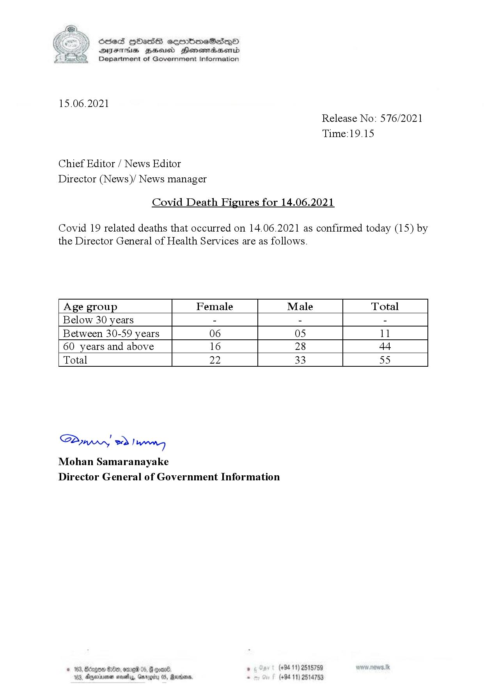

# Press Release - 2021.06.15 - Covid Death Figures for 14.06.2021 
Key: 776ded36f44e3758869529b1841450a8 

---
```
(6 S) ScseS HOasdS cerrbmeSdQo
DFTs BHEosd Henewtaeasernid
Department of Government Information

 

15.06.2021

Chief Editor / News Editor
Director (News)/ News manager

Covid Death Figures for 14.06.2021

Release No: 576/2021
Time:19.15

Covid 19 related deaths that occurred on 14.06.2021 as confirmed today (15) by

the Director General of Health Services are as follows.

 

 

 

 

 

 

 

 

 

 

Age group Female Male Total
Below 30 years - - -
Between 30-59 years 06 05 ll
60 years and above 16 28 44
Total 22 33 55

 

SAmwwy 2) wong
Mohan Samaranayake
Director General of Government Information

 

© 163, Bdzgoa Oe, ome 05,

163, Dnexirsonan novellas, Gn

 

. (+94 11) 2515759
(+94 11) 2514753

```
